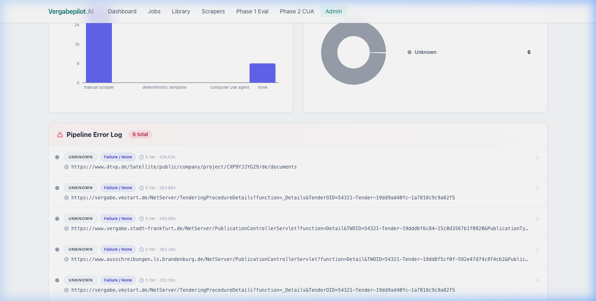
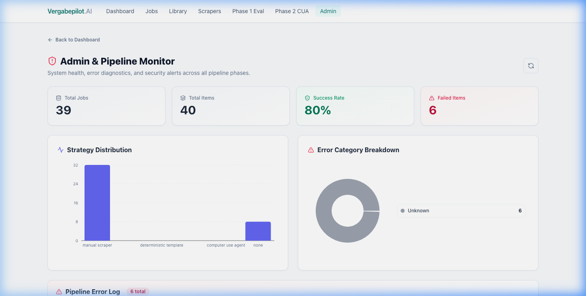
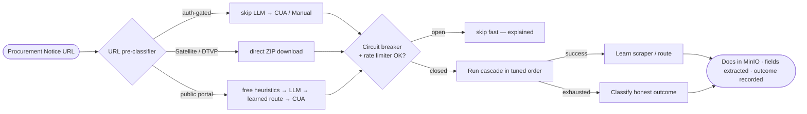
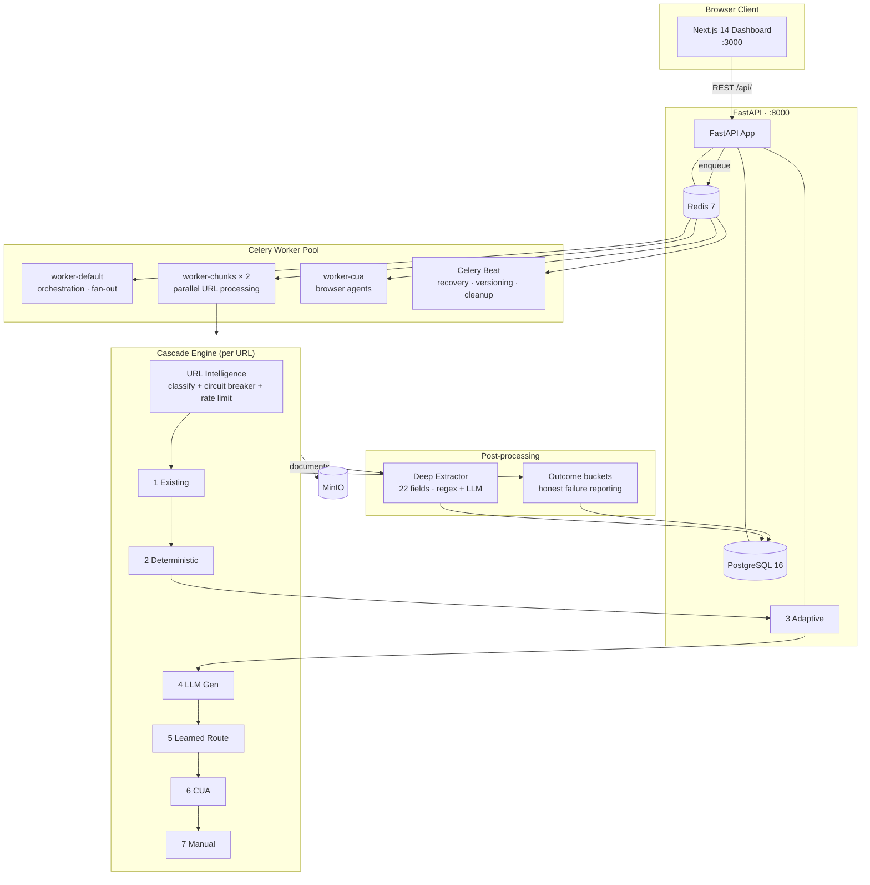

# Vergabepilot.AI ⚡

<div align="center">

**Autonomous Agentic AI for Public Procurement Document Extraction — at any scale, in any country**

*SoSe 2026 · CORE Research Group · Ciconia Systems GmbH*

[](https://github.com/Siddharthpatni/Vergabepilot-v1/actions/workflows/ci.yml)


</div>

---

Vergabepilot.AI automates scraping and downloading of public-procurement tender documents across thousands of fragmented portals — German, EU, and **30+ portal families across every continent**. Instead of brittle hand-written scrapers it runs an intelligent **Agentic Cascade Pipeline**: a chain of 7 strategies tried cheapest-first, stopping the moment one succeeds, learning from every success, and reporting an **honest, human-readable reason** whenever a URL genuinely cannot be scraped (login wall, CAPTCHA, expired, unreachable).

```
Cached → Deterministic → Adaptive → LLM Generated → Learned Route → CUA Agent → Manual
 ↓ ms      ↓ 1-50s        ↓ free      ↓ 10-45s        ↓ cheap          ↓ 30-120s    ↓ 5-45s
 free        free          free       ~$0.00001       Playwright       vision LLM    pre-written
```

A URL pre-classifier routes each URL to the **optimal** strategy order for its portal type, so auth-gated portals skip the expensive LLM step entirely and Satellite/DTVP URLs go straight to a free direct download. The whole thing is built to ingest **1,000+ URLs per job (designed to 10,000+)** without falling over.

---

## Screenshots

<table>
  <tr>
    <td align="center"><br/><sub><b>Live Dashboard — KPIs + Strategy Analytics</b></sub></td>
    <td align="center"><br/><sub><b>Admin Panel — Outcome Breakdown + Needs-Manual Queue</b></sub></td>
  </tr>
  <tr>
    <td align="center"><br/><sub><b>CUA Agent — Visual Browser Automation Sessions</b></sub></td>
    <td align="center"><br/><sub><b>LLM Evaluation — Model Performance Benchmarks</b></sub></td>
  </tr>
</table>

---

## Table of Contents

- [How It Works](#how-it-works)
- [The 7-Strategy Cascade](#the-7-strategy-cascade)
- [URL Intelligence & Global Coverage](#url-intelligence--global-coverage)
- [System Architecture](#system-architecture)
- [Technology Stack](#technology-stack)
- [Quickstart](#quickstart)
- [Project Structure](#project-structure)
- [Key Features](#key-features)
- [Performance & Scale](#performance--scale)
- [Documentation](#documentation)
- [Contributing](#contributing)

---

## How It Works



Every URL is pre-classified (no HTTP) into one of **30 portal types**, which selects the cheapest viable strategy order. A per-domain **circuit breaker** and **rate limiter** protect both the system and the target portal. On success, the system *learns* — a generated scraper or a replayable CUA route is saved and reused for free on every future visit to that domain. On genuine failure, the error is classified into a small set of **honest outcome buckets** so an operator knows exactly what (if anything) a human can do about it.

---

## The 7-Strategy Cascade

Each URL passes through strategies in cost-ascending order. The first to return documents wins; the rest are skipped. The order is **tuned per URL type** — not every URL runs all 7.

| # | Strategy | Enum | Cost | Speed | What it does |
|---|----------|------|------|-------|--------------|
| 1 | **Existing / Cached** | `existing_scraper` | Free | ms–25s | Replays a scraper already saved for this domain |
| 2 | **Deterministic** | `deterministic_template` | Free | 1–50s | Builds the ZIP URL directly for DTVP/Satellite/NetServer — no browser, no LLM |
| 3 | **Adaptive** *(new)* | `adaptive_universal` | Free | 5–30s | Country/language-agnostic heuristic scraper: one bounded Playwright pass that harvests docs directly or after a single multilingual click-hop |
| 4 | **LLM Generated** | `llm_generated_scraper` | ~$0.00001 | 10–45s | LLM writes Playwright code, runs it in a sandbox, and self-heals from the error up to 3× |
| 5 | **Learned Route** *(new)* | `learned_route` | Cheap | 5–20s | Replays a navigation route the CUA previously proved works — no LLM, no vision |
| 6 | **CUA Agent** | `computer_use_agent` | ~$0.001–0.05 | 30–120s | Visual browser agent (browser-use) that *sees* the page and clicks like a human |
| 7 | **Manual** | `manual_scraper` | Free | 5–45s | Hand-written reference scrapers for the hardest/highest-volume domains |

**Two strategies are injected automatically** by the URL-intelligence layer: `ADAPTIVE` is slotted in just before the paid `LLM_GENERATED` step (try the free universal heuristic first), and `LEARNED_ROUTE` is slotted in just before `CUA` (replay a known-good route cheaply before paying for full vision).

**Self-learning loop:** when CUA is the *only* thing that worked, the system records a replayable route and the interaction trace. The next visit to that domain replays the route for pennies (Strategy 5) and feeds the trace to the LLM generator (Strategy 4) as ground-truth navigation knowledge.

See **[docs/PIPELINE.md](docs/PIPELINE.md)** for the full flowchart of every stage.

---

## URL Intelligence & Global Coverage

Before the cascade runs, `phase3_integration/url_intelligence.py` classifies each URL — **using the URL string alone, no network call** — into one of 30 `UrlType` categories. Each type carries an expected success rate and a hand-tuned strategy order.

**Why it matters:** auth-gated portals (vendor login required) waste ~90s of LLM generation that logs show *never* succeeds. The classifier routes them straight to `[EXISTING, CUA, MANUAL]` and skips the LLM, saving both time and API budget on every such URL.

| Region | Covered portal families |
|--------|------------------------|
| 🇩🇪 **Germany / DTVP** | Satellite/VMPSatellite, NetServer (public + auth), eVergabe Cosinex deeplinks, e-VA, subreport ELViS, evergabe-online |
| 🇪🇺 **EU** | TED Europa, UK Find-a-Tender, France PLACE/BOAMP, Poland miniPortal/BZP, Spain PLACE, Portugal BASE, Netherlands TenderNed, Belgium e-Procurement, Austria, Switzerland SIMAP, Italy CONSIP/MEPA, Ireland eTenders, Nordics (Doffin/Mercell/Hilma/Udbud), Eastern Europe (GR/CZ/HU/RO/SK/SI/HR/BG/EE/LV/LT) |
| 🌎 **Americas** | USA SAM.gov/grants.gov, Canada CanadaBuys/MERX, LATAM (BR/MX/CL/AR/CO/PE) |
| 🌏 **Asia** | India GeM/eProcure/NIC, plus SG/JP/CN/KR and South Asia |
| 🌍 **Africa** | ZA/KE/NG/EG e-tender portals |
| 🇦🇺 **Oceania** | Australia AusTender + state portals, New Zealand GETS |

For any URL that doesn't match a known family (`UNKNOWN`), the free **Adaptive** strategy provides a genuinely country-agnostic catch-all — it works off multilingual document-navigation keywords rather than hardcoded selectors — before any money is spent on the LLM. Batch endpoints (`POST /api/admin/url-intelligence/batch`) can pre-classify up to 50,000 URLs to forecast success and surface auth-gated URLs *before* a run starts.

---

## System Architecture



**Default capacity:** ~**32 URLs processed concurrently** (2 chunk replicas × 2 Celery slots × `JOB_CONCURRENCY=8` asyncio). Jobs of any size are chunked (`JOB_CHUNK_SIZE=50`) and fanned out, so a 10,000-URL job streams through the same fixed worker pool. Scale `worker-chunks` replicas for higher throughput.

---

## Technology Stack

| Layer | Technology | Version |
|---|---|---|
| **Frontend** | Next.js, React, TypeScript | 14.x / 18.x / 5.6 |
| **Styling** | Tailwind CSS, CSS Variables | 3.4 |
| **Data Fetching** | SWR + custom retry fetcher | 2.2 |
| **Charts** | Recharts | 2.12 |
| **Backend API** | FastAPI + Uvicorn | 0.115 / 0.32 |
| **Language** | Python | 3.11 |
| **Validation** | Pydantic v2 | 2.9+ |
| **ORM / Migrations** | SQLAlchemy 2.0 / Alembic 1.13 | — |
| **Task Queue** | Celery + Redis | 5.4 / 7.x |
| **Database** | PostgreSQL | 16 |
| **Object Storage** | MinIO (S3-compatible) | latest |
| **Browser Automation** | Playwright | 1.47 |
| **Visual Agents** | browser-use | 0.12 |
| **LLM Provider** | OpenRouter → Gemini 2.5 Flash Lite | free tier |
| **Resilience** | Redis circuit breaker · domain rate limiter · HTTP retry+backoff | — |
| **Containerisation** | Docker Compose | — |
| **Observability** | Prometheus · append-only audit log · structlog correlation IDs | — |
| **CI/CD** | GitHub Actions | — |

---

## Quickstart

### Prerequisites

| Requirement | Minimum |
|---|---|
| Docker Desktop | 4.x |
| RAM for Docker | 8 GB (16 GB recommended for CUA workers) |
| Disk space | 10 GB |

### 1 — Clone

```bash
git clone https://github.com/Siddharthpatni/Vergabepilot-v1.git
cd Vergabepilot-v1
```

### 2 — Configure

```bash
cp .env.example .env
```

Fill in the **required** values in `.env`:

```env
# Generate: python3 -c "import secrets; print(secrets.token_hex(32))"
SECRET_KEY=<64-char hex string>

POSTGRES_USER=vergabepilot
POSTGRES_PASSWORD=<strong-password-16-chars-min>

MINIO_ROOT_USER=<username-not-minioadmin>
MINIO_ROOT_PASSWORD=<strong-password-12-chars-min>

# Free key at https://openrouter.ai
OPENROUTER_API_KEY=sk-or-v1-...

# Models — all default to Gemini 2.5 Flash Lite (free tier)
LLM_MODEL_PRIMARY=google/gemini-2.5-flash-lite
LLM_MODEL_FALLBACK=google/gemini-2.5-flash-lite
LLM_MODEL_VISION=google/gemini-2.5-flash-lite
```

### 3 — Build & Start

```bash
docker compose build
docker compose up -d
```

### 4 — Verify

```bash
docker compose ps
# All services: "healthy"

curl localhost:8000/health
# {"status":"ok","database":"ok","version":"0.2.0"}

curl localhost:8000/ready
# {"status":"ready","checks":{"database":"ok","redis":"ok"}}
```

### 5 — Open Dashboard

**[http://localhost:3000](http://localhost:3000)** — paste one or many procurement notice URLs (or upload a CSV/Excel) and watch the cascade process them live.

> **Public tender directory:** [http://localhost:3000/directory](http://localhost:3000/directory) — browse open tenders by portal  
> **MinIO Console:** [http://localhost:9001](http://localhost:9001) — browse stored documents  
> **API Docs (Swagger):** [http://localhost:8000/docs](http://localhost:8000/docs)

---

## Project Structure

```
vergabepilot-ai/
│
├── backend/
│   ├── app/
│   │   ├── api/                    # FastAPI route handlers
│   │   │   ├── routes_jobs.py      # Job CRUD + upload + retry + stop + diagnostics + needs-manual
│   │   │   ├── routes_scrapers.py  # Scraper registry + route learning
│   │   │   ├── routes_directory.py # Public tender directory (browse by domain)
│   │   │   ├── routes_admin.py     # Stats + outcomes + circuit breakers + url-intelligence
│   │   │   ├── routes_audit.py     # Append-only event log
│   │   │   ├── routes_extractor.py # Document field extraction + reports
│   │   │   ├── routes_evaluation.py# LLM benchmark + pipeline analytics + scraper health
│   │   │   ├── routes_agents.py    # CUA agent sessions
│   │   │   └── routes_tests.py     # Backend test runner
│   │   │
│   │   ├── core/
│   │   │   ├── security.py         # SSRF + prompt injection + classify_error (27 categories)
│   │   │   ├── storage.py          # MinIO / S3 client (local fallback)
│   │   │   ├── http_client.py      # Resilient HTTP: retry + backoff + jitter, honours Retry-After
│   │   │   ├── web_harvest.py      # Multilingual document harvesting (powers Adaptive)
│   │   │   ├── ratelimit.py        # Per-IP API rate limiter (public directory)
│   │   │   ├── sandbox.py          # Sandboxed scraper execution primitives
│   │   │   ├── browser_session.py  # Shared Playwright session helpers
│   │   │   ├── llm_client.py       # OpenRouter client with retries + global semaphore
│   │   │   ├── metrics.py          # Prometheus counters + histograms
│   │   │   └── zip_expander.py     # Recursive ZIP extraction (bomb-safe)
│   │   │
│   │   ├── document_extractor/     # Deep field extraction (post-download)
│   │   │   ├── extractor.py        # Orchestrator: regex + structural + optional LLM merge
│   │   │   ├── field_extractor.py  # German procurement regex patterns
│   │   │   ├── parsers.py          # PDF / DOCX / XLSX text extraction
│   │   │   ├── dates.py            # Robust multi-format date parsing
│   │   │   ├── summarizer.py       # Deterministic rule-based summary
│   │   │   ├── llm_enhancer.py     # Gemini field boost (optional)
│   │   │   ├── report_builder.py   # PDF + DOCX report generation
│   │   │   └── live_fetcher.py     # Fallback live document fetch
│   │   │
│   │   ├── phase0_manual/v1_reference.py   # Hand-written reference scraper
│   │   │
│   │   ├── phase1_llm_scraper/     # Strategy 4 — LLM code generation
│   │   │   ├── generator.py · prompts.py   # Prompt + code builder
│   │   │   ├── executor.py · validator.py  # Sandbox runner + code safety
│   │   │   ├── feedback_loop.py             # Iterative self-healing (3 retries)
│   │   │   ├── document_validator.py        # Magic-byte / real-document checks
│   │   │   ├── route_learner.py · cua_discovery.py  # Route tracing
│   │   │   ├── evaluator.py · pricing.py    # Benchmarks + cost accounting
│   │   │
│   │   ├── phase2_cua/             # Strategy 6 — Computer Use Agent
│   │   │   ├── browser_agent.py · browser_use_agent.py
│   │   │   ├── orchestrator.py     # Agent dispatcher
│   │   │   └── route_learner.py    # Learn / replay CUA routes (Strategy 5)
│   │   │
│   │   ├── phase3_integration/     # The cascade engine
│   │   │   ├── pipeline.py         # Cascade orchestrator (process_url)
│   │   │   ├── url_intelligence.py # 30 UrlTypes + strategy ordering + circuit breaker + rate limiter
│   │   │   ├── adaptive_scraper.py # Strategy 3 — universal heuristic scraper
│   │   │   ├── deterministic.py    # Strategy 2 — direct ZIP download
│   │   │   ├── platform_classifier.py # Portal fingerprinting + URL builders
│   │   │   ├── scraper_registry.py # Save / load / upgrade scrapers + learned routes
│   │   │   ├── outcomes.py         # Honest failure buckets + needs-manual logic
│   │   │   ├── portal_directory_seed.py # 100 seed portal domains for the directory
│   │   │   ├── versioning.py       # Document change detection (SHA-256)
│   │   │   └── fallback.py         # Next-strategy selector
│   │   │
│   │   ├── workers/
│   │   │   ├── celery_app.py       # Queues (default/chunks/cua/beat) + beat schedule
│   │   │   └── tasks.py            # Job fan-out, chunk processing, beat tasks
│   │   │
│   │   ├── utils/                  # structlog logger (correlation IDs), audit, metrics
│   │   ├── models.py · schemas.py · config.py · database.py · main.py
│   │
│   ├── migrations/                 # Alembic: baseline → learned_route → directory fields
│   └── tests/                      # pytest — 225 tests
│
├── frontend/
│   ├── app/                        # Next.js App Router pages
│   │   ├── page.tsx                # Dashboard (KPIs + submit form + strategy chart)
│   │   ├── jobs/                   # Job list + job detail (cascade trail)
│   │   ├── directory/              # Public tender directory (browse by portal)
│   │   ├── library/                # Saved/local tender document library
│   │   ├── extraction/             # Deep field extraction
│   │   ├── scrapers/               # Scraper registry + route learning
│   │   ├── audit/                  # Append-only audit log viewer
│   │   ├── admin/                  # Outcome breakdown + needs-manual + system health
│   │   ├── agents/                 # CUA agent sessions
│   │   ├── evaluation/             # LLM benchmark + pipeline analytics
│   │   ├── excel/                  # Excel workspace (IndexedDB)
│   │   └── tests/                  # Backend test runner UI
│   │
│   ├── components/                 # Navbar, JobSubmitForm, StatusBadge, StatCard, Toast, ui/
│   └── lib/                        # api.ts (retry fetcher), hooks.ts, types.ts, theme.ts
│
├── data/scrapers/                  # 50 auto-saved + hand-written domain scrapers
├── docs/                           # Architecture, pipeline, API, deployment, frontend docs
├── .env.example                    # All env vars documented
├── .github/workflows/ci.yml        # CI: test → lint → security → docker
└── docker-compose.yml              # Full production stack
```

> The standalone offline `tender_extractor/` library and the experimental CUA agents now live under `_archive/`. The **active** extraction engine is `backend/app/document_extractor/`, which runs automatically after every successful download.

---

## Key Features

### 🔄 7-Strategy Cascade Pipeline
Each URL is tried through up to 7 strategies in cost-ascending order, in an order tuned to its portal type. One failure never blocks others — the pipeline isolates errors at the URL level and records the full attempt chain.

### 🌍 Global URL Intelligence
30 portal-family classifiers spanning every continent select the cheapest viable strategy order per URL, skip the LLM for auth-gated portals, and provide a free country-agnostic Adaptive fallback for anything unrecognised.

### 🤖 Self-Healing & Self-Learning
Generated scraper code that fails is sent back to the LLM with the full error (code + stdout/stderr + traceback) for up to 3 automatic corrections. Successful scrapers are saved to the registry; CUA-only successes are distilled into replayable routes — both reused for free forever.

### 🛡️ Production Resilience at Scale
Per-domain Redis **circuit breaker** (trips after repeated failures, re-opens after 30 min), **domain rate limiter** (token bucket), a **domain LLM dedup lock** (so N workers don't all call the LLM for the same domain), a **global LLM semaphore**, resilient HTTP retry/backoff, job resumability, and hourly disk cleanup — all designed for 10,000-URL runs.

### 🔍 Deep Document Extraction
After download, a second pipeline parses PDF/DOCX/XLSX and extracts **22 structured procurement fields** with German-language regex (optionally LLM-enhanced), then can render a branded PDF or DOCX report.

| Field | Example |
|---|---|
| `vergabenummer` | VN-2026-0042 |
| `auftraggeber` | Bundesministerium der Finanzen |
| `abgabefrist` | 2026-07-15 |
| `auftragswert` | EUR 500,000 |
| `cpv_codes` | 39130000, 39150000 |
| `email` | vergabe@bund.de |

### 📂 Public Tender Directory
A read-only, rate-limited public view (`/api/directory`) browses **currently-open** tenders grouped by portal — exposing only a whitelist of tender-facing fields, never internal errors, costs, or strategy traces. A successful scrape *is* a published tender.

### ✅ Honest Failure Reporting
The ~27 fine-grained failure categories collapse into 8 plain-English **outcome buckets** (succeeded · login/registration required · CAPTCHA · expired/not-found · unreachable · no documents · blocked · error). The two buckets a human can actually fix surface in a **"Needs manual action"** queue (`GET /api/jobs/needs-manual`) with a suggested next step.

### 📊 Real-time Observability
Live dashboard KPIs and strategy distribution, searchable append-only audit log, Prometheus metrics at `/metrics` (scrapes, durations, retries, circuit-breaker events, rate-limit hits), and per-job diagnostics grouped by domain + error category. Every log line carries a `job:item` correlation ID.

---

## Performance & Scale

| Metric | Value | Notes |
|---|---|---|
| Concurrent URLs (default) | **~32** | 2 chunk replicas × 2 Celery slots × `JOB_CONCURRENCY=8` |
| Job size | **1,000+ URLs** | Chunked fan-out, designed to 10,000+ |
| API read latency | < 200 ms p95 | Reads; writes go to Celery |
| Deterministic / cached hit | free, 1–50 s | No LLM, no browser |
| LLM cost per URL | ~$0.00001 | Gemini 2.5 Flash Lite free tier |
| Document extraction | < 5 s (regex) / 10–30 s (+LLM) | Runs after each successful download |
| Test suite | **225 tests** | Backend pytest, SQLite, no external deps |

**Scaling workers:**
```bash
# ~2× throughput
docker compose up --scale worker-chunks=4 -d

# ~4× throughput
docker compose up --scale worker-chunks=8 -d
```

How a large job flows: `POST /api/jobs` enqueues `process_job_task` → items are **sorted by expected success rate** and split into chunks of 50 → `process_chunk_task` instances run in parallel, each processing its chunk with asyncio. Chunk tasks skip already-`SUCCESS` items on retry (resumability), and beat tasks rescue zombie jobs (every 10 min) and clean stale download dirs (hourly).

---

## Documentation

| Document | Description |
|---|---|
| [Architecture](docs/ARCHITECTURE.md) | System design, component & DB diagrams, worker model, security, observability |
| [Pipeline](docs/PIPELINE.md) | All 7 cascade strategies, URL intelligence, circuit breaker, self-healing, outcome buckets |
| [API Reference](docs/API.md) | Every endpoint — jobs, scrapers, directory, admin, audit, extraction, evaluation, agents |
| [Deployment](docs/DEPLOYMENT.md) | Docker setup, env vars, production checklist, scaling, troubleshooting |
| [Development](docs/DEVELOPMENT.md) | Local dev, testing, conventions, adding strategies and scrapers |
| [Frontend](docs/FRONTEND.md) | All pages, component library, dark-mode system, SWR patterns |
| [Tender Extractor](docs/TENDER_EXTRACTOR.md) | The deep-extraction module — fields, parsers, reports |

---

## CI / CD

The GitHub Actions pipeline runs on every push and pull request:

```
git push → Backend Tests (225) → Frontend Build + TS Check → Security Scan → Docker Build
```

```yaml
# .github/workflows/ci.yml stages:
backend-test:   pytest (SQLite, no external deps)
frontend-check: tsc --noEmit + eslint + next build
security-scan:  pip-audit (Python CVEs) + npm audit (Node CVEs)
container-build: docker build backend + frontend images
```

---

## Contributing

1. Fork the repository
2. Create a feature branch: `git checkout -b feat/my-feature`
3. Follow the conventions in [docs/DEVELOPMENT.md](docs/DEVELOPMENT.md)
4. Run tests: `pytest tests/ -v` (backend, from `backend/`) and `npm run build` (frontend)
5. Open a pull request against `main`

---

## License

MIT License — see [LICENSE](LICENSE) for details.

---

<div align="center">

*Vergabepilot.AI · SoSe 2026 · CORE Research Group · Developed by Siddharth Patni*

</div>
