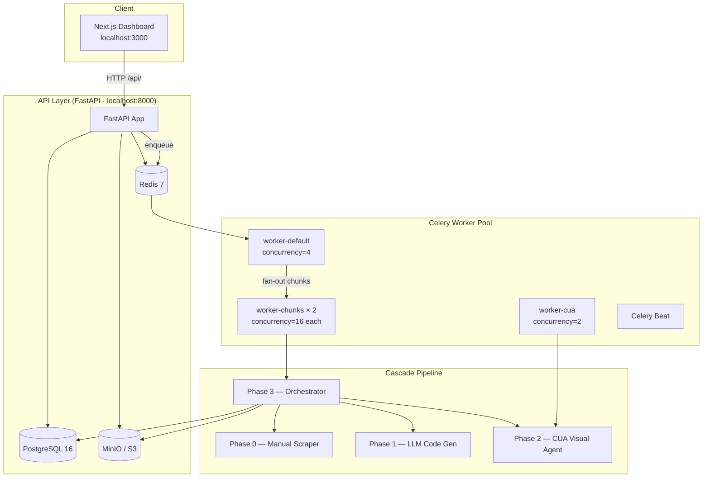

# Vergabepilot.AI ⚡

**Autonomous Agentic AI for Public Procurement Document Extraction**

*SoSe 2026 · CORE Research Group · Ciconia Systems GmbH*  
*Developed by: Siddharth Patni*

---

## What is Vergabepilot.AI?

Vergabepilot.AI is a production-ready, modular system that automates the scraping and downloading of public procurement tender documents across thousands of fragmented German and EU portals. Instead of brittle manual scrapers, it uses an intelligent **Agentic Cascade Pipeline** that degrades gracefully from fast cached strategies down to fully autonomous visual browser agents.

```
URL in → [ Manual → Cached → Deterministic → LLM → CUA ] → Documents out
```

Each stage is only attempted if the previous one fails, minimising cost and latency while maximising coverage.

---

## Quick Links

| Document | Description |
|---|---|
| [Architecture Overview](docs/ARCHITECTURE.md) | System design, component diagram, data flow |
| [Cascade Pipeline](docs/PIPELINE.md) | All 5 pipeline stages with flow charts |
| [API Reference](docs/API.md) | Every endpoint, request/response schema |
| [Deployment Guide](docs/DEPLOYMENT.md) | Docker, environment variables, production checklist |
| [Development Setup](docs/DEVELOPMENT.md) | Local dev, testing, contributing |
| [Frontend Guide](docs/FRONTEND.md) | Component library, pages, dark mode system |
| [Tender Extractor](docs/TENDER_EXTRACTOR.md) | Offline document field extraction module |

---

## System at a Glance



---

## Technology Stack

| Layer | Technology |
|---|---|
| Frontend | Next.js 14, React 18, Tailwind CSS, SWR, Recharts |
| Backend API | FastAPI 0.115, Python 3.11, Pydantic v2 |
| Task Queue | Celery 5.4, Redis 7 |
| Database | PostgreSQL 16, SQLAlchemy 2.0, Alembic |
| Object Storage | MinIO (S3-compatible) |
| Browser Automation | Playwright 1.47, browser-use |
| LLM Provider | OpenRouter → Gemini 2.5 Flash Lite (free tier) |
| Containerisation | Docker + Docker Compose |
| Observability | Prometheus metrics, append-only audit log |

---

## Quickstart

### Prerequisites
- Docker Desktop ≥ 4.x with 8 GB RAM allocated (16 GB for CUA workers)

### 1 — Clone and configure

```bash
git clone https://github.com/Siddharthpatni/Vergabepilot-v1.git
cd Vergabepilot-v1
cp .env.example .env
# Edit .env and fill in all required values
```

Minimum required `.env` values:

```env
# Generate with: python3 -c "import secrets; print(secrets.token_hex(32))"
SECRET_KEY=<64-char hex string>

POSTGRES_USER=vergabepilot
POSTGRES_PASSWORD=<strong password>

MINIO_ROOT_USER=<your username>
MINIO_ROOT_PASSWORD=<strong password>

# Get a free key at https://openrouter.ai
OPENROUTER_API_KEY=sk-or-v1-...
```

### 2 — Build and start

```bash
docker compose build
docker compose up -d
```

### 3 — Verify everything is healthy

```bash
docker compose ps
# All services should show "healthy"

curl localhost:8000/health
# {"status":"ok","database":"ok","version":"0.2.0"}

curl localhost:8000/ready
# {"status":"ready","checks":{"database":"ok","redis":"ok"}}
```

### 4 — Open the dashboard

Navigate to **[http://localhost:3000](http://localhost:3000)**, paste a procurement notice URL, and watch the cascade pipeline process it live.

---

## Project Structure

```
vergabepilot-ai/
├── backend/
│   ├── app/
│   │   ├── api/                  # FastAPI route handlers (jobs, scrapers, audit…)
│   │   ├── core/                 # Storage, metrics, security, zip expander
│   │   ├── document_extractor/   # Offline field extraction from downloaded docs
│   │   ├── models.py             # SQLAlchemy ORM (Job, Document, AuditLog…)
│   │   ├── config.py             # Centralised Pydantic settings
│   │   ├── main.py               # FastAPI app + startup / shutdown hooks
│   │   ├── phase0_manual/        # Pre-written Playwright domain scrapers
│   │   ├── phase1_llm_scraper/   # LLM code generation + sandboxed execution
│   │   ├── phase2_cua/           # Computer-use visual browser agents
│   │   ├── phase3_integration/   # Cascade orchestrator + scraper registry
│   │   └── workers/              # Celery task definitions
│   ├── migrations/               # Alembic migration scripts
│   └── tests/                    # pytest suite — 95 tests
├── frontend/
│   ├── app/                      # Next.js App Router pages
│   ├── components/               # Shared UI + design system (Toast, Modal…)
│   └── lib/                      # API client, SWR hooks, TypeScript types
├── tender_extractor/             # Standalone offline extraction library
├── data/scrapers/                # Auto-saved domain scraper scripts
├── docs/                         # Full documentation (this folder)
└── docker-compose.yml
```

---

## Key Features

| Feature | Detail |
|---|---|
| **5-Stage Cascade** | Fails gracefully through 5 strategies; one bad portal never blocks others |
| **Gemini 2.5 Flash Lite** | Free-tier LLM for scraper code generation and document field enhancement |
| **32 Parallel URLs** | 2 × worker-chunks replicas, each with concurrency=16 |
| **Self-Healing Loop** | LLM feedback retries failed scrapers up to 3× with full error context |
| **Scraper Registry** | Successful scrapers saved and reused automatically across all future jobs |
| **Deep Field Extraction** | Regex + LLM extracts 22 structured procurement fields per document |
| **Real-time Dashboard** | Live strategy analytics, attempt timeline, per-domain failure breakdown |
| **ZIP Bomb Protection** | 500 MB limit, depth-3 recursive extraction, magic-byte validation |
| **Security Guards** | SSRF protection, prompt injection detection, sandboxed code execution |
| **Append-only Audit Log** | Every pipeline event recorded; full replay of any job's history |

---

## Performance

| Metric | Target |
|---|---|
| Peak throughput | 32 URLs/min (scale `worker-chunks` replicas for more) |
| API read latency | < 200 ms p95 |
| LLM cost per URL | ~$0.00001 (Gemini free tier) |
| Document extraction | < 5 s/doc (regex only) · 10–30 s (with LLM enhancement) |

---

## Contributing

See [docs/DEVELOPMENT.md](docs/DEVELOPMENT.md) for environment setup, running tests, and coding guidelines.

---

*Vergabepilot.AI · SoSe 2026 · CORE Research Group*
