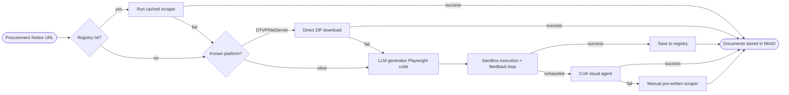
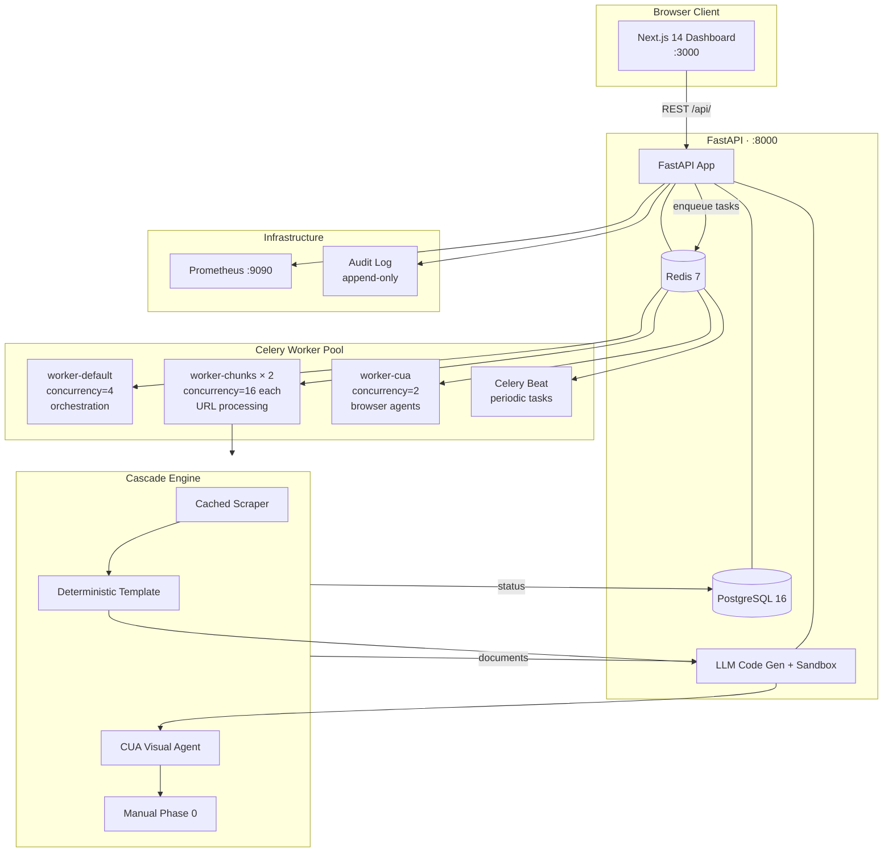

# Vergabepilot.AI ⚡

<div align="center">

**Autonomous Agentic AI for Public Procurement Document Extraction**

*SoSe 2026 · CORE Research Group · Ciconia Systems GmbH*

[](https://github.com/Siddharthpatni/Vergabepilot-v1/actions/workflows/ci.yml)


</div>

---

Vergabepilot.AI automates the scraping and downloading of public procurement tender documents across thousands of fragmented German and EU portals. Instead of brittle manual scrapers it uses an intelligent **Agentic Cascade Pipeline** — 5 strategies tried in order, stopping the moment one succeeds.

```
Cached → Deterministic → LLM Generated → CUA Agent → Manual Fallback
  ↓ ms       ↓ seconds        ↓ 10-45s       ↓ 30-120s     ↓ 5-45s
  free         free           ~$0.00001       vision LLM    pre-written
```

---

## Screenshots

<table>
  <tr>
    <td align="center"><br/><sub><b>Live Dashboard — KPIs + Strategy Analytics</b></sub></td>
    <td align="center"><br/><sub><b>Admin Panel — Error Breakdown + System Health</b></sub></td>
  </tr>
  <tr>
    <td align="center"><br/><sub><b>CUA Agent — Visual Browser Automation Sessions</b></sub></td>
    <td align="center"><br/><sub><b>LLM Evaluation — Model Performance Benchmarks</b></sub></td>
  </tr>
</table>

---

## Table of Contents

- [How It Works](#how-it-works)
- [System Architecture](#system-architecture)
- [Technology Stack](#technology-stack)
- [Quickstart](#quickstart)
- [Project Structure](#project-structure)
- [Key Features](#key-features)
- [Performance](#performance)
- [Documentation](#documentation)
- [Contributing](#contributing)

---

## How It Works



Each URL passes through up to 5 strategies. A failure in one stage triggers the next automatically. The system learns from success — newly generated scrapers are saved and reused for free on all future runs.

---

## System Architecture



**Capacity:** 2 × 16 = **32 simultaneous URLs** by default. Scale `worker-chunks` replicas for more throughput.

---

## Technology Stack

| Layer | Technology | Version |
|---|---|---|
| **Frontend** | Next.js, React, TypeScript | 14.x / 18.x / 5.6 |
| **Styling** | Tailwind CSS, CSS Variables | 3.4 |
| **Data Fetching** | SWR + custom retry fetcher | 2.2 |
| **Charts** | Recharts | 2.12 |
| **Backend API** | FastAPI + Uvicorn | 0.115 / 0.32 |
| **Language** | Python | 3.11 |
| **Validation** | Pydantic v2 | 2.9+ |
| **ORM** | SQLAlchemy | 2.0 |
| **Migrations** | Alembic | 1.13 |
| **Task Queue** | Celery + Redis | 5.4 / 7.x |
| **Database** | PostgreSQL | 16 |
| **Object Storage** | MinIO (S3-compatible) | latest |
| **Browser Automation** | Playwright | 1.47 |
| **Visual Agents** | browser-use | 0.12 |
| **LLM Provider** | OpenRouter → Gemini 2.5 Flash Lite | free tier |
| **Containerisation** | Docker Compose | — |
| **Observability** | Prometheus + Audit Log | — |
| **CI/CD** | GitHub Actions | — |

---

## Quickstart

### Prerequisites

| Requirement | Minimum |
|---|---|
| Docker Desktop | 4.x |
| RAM for Docker | 8 GB (16 GB recommended for CUA workers) |
| Disk space | 10 GB |

### 1 — Clone

```bash
git clone https://github.com/Siddharthpatni/Vergabepilot-v1.git
cd Vergabepilot-v1
```

### 2 — Configure

```bash
cp .env.example .env
```

Fill in the **required** values in `.env`:

```env
# Generate: python3 -c "import secrets; print(secrets.token_hex(32))"
SECRET_KEY=<64-char hex string>

POSTGRES_USER=vergabepilot
POSTGRES_PASSWORD=<strong-password-16-chars-min>

MINIO_ROOT_USER=<username-not-minioadmin>
MINIO_ROOT_PASSWORD=<strong-password-12-chars-min>

# Free key at https://openrouter.ai
OPENROUTER_API_KEY=sk-or-v1-...

# Models — all default to Gemini 2.5 Flash Lite (free tier)
LLM_MODEL_PRIMARY=google/gemini-2.5-flash-lite
LLM_MODEL_FALLBACK=google/gemini-2.5-flash-lite
LLM_MODEL_VISION=google/gemini-2.5-flash-lite
```

### 3 — Build & Start

```bash
docker compose build
docker compose up -d
```

### 4 — Verify

```bash
docker compose ps
# All services: "healthy"

curl localhost:8000/health
# {"status":"ok","database":"ok","version":"0.2.0"}

curl localhost:8000/ready
# {"status":"ready","checks":{"database":"ok","redis":"ok"}}
```

### 5 — Open Dashboard

**[http://localhost:3000](http://localhost:3000)** — paste a procurement notice URL and watch the cascade pipeline process it in real time.

> **MinIO Console:** [http://localhost:9001](http://localhost:9001) — browse stored documents  
> **API Docs (Swagger):** [http://localhost:8000/docs](http://localhost:8000/docs)

---

## Project Structure

```
vergabepilot-ai/
│
├── backend/
│   ├── app/
│   │   ├── api/                    # FastAPI route handlers
│   │   │   ├── routes_jobs.py      # Job CRUD + retry + diagnostics
│   │   │   ├── routes_scrapers.py  # Scraper registry + route learning
│   │   │   ├── routes_admin.py     # Stats + system controls
│   │   │   ├── routes_audit.py     # Append-only event log
│   │   │   ├── routes_extractor.py # Document field extraction
│   │   │   ├── routes_evaluation.py# LLM benchmark suite
│   │   │   ├── routes_agents.py    # CUA agent sessions
│   │   │   └── routes_tests.py     # Backend test runner
│   │   │
│   │   ├── core/
│   │   │   ├── security.py         # SSRF + prompt injection guards
│   │   │   ├── storage.py          # MinIO / S3 client
│   │   │   ├── metrics.py          # Prometheus counters + histograms
│   │   │   └── zip_expander.py     # Recursive ZIP extraction (bomb-safe)
│   │   │
│   │   ├── document_extractor/
│   │   │   ├── extractor.py        # Orchestrator: regex + LLM merge
│   │   │   ├── field_extractor.py  # 50+ German procurement regex patterns
│   │   │   ├── parsers.py          # PDF / DOCX / XLSX text extraction
│   │   │   ├── llm_enhancer.py     # Gemini 2.5 Flash Lite field boost
│   │   │   ├── report_builder.py   # PDF + DOCX report generation
│   │   │   └── live_fetcher.py     # Fallback live document fetch
│   │   │
│   │   ├── phase0_manual/
│   │   │   └── v1_reference.py     # Playwright manual scraper (legacy)
│   │   │
│   │   ├── phase1_llm_scraper/
│   │   │   ├── generator.py        # LLM prompt + code builder
│   │   │   ├── executor.py         # Sandboxed Playwright runner
│   │   │   ├── feedback_loop.py    # Iterative self-healing (3 retries)
│   │   │   ├── validator.py        # Code safety + SSRF validation
│   │   │   ├── evaluator.py        # Benchmark runner
│   │   │   └── route_learner.py    # CUA trace recorder
│   │   │
│   │   ├── phase2_cua/
│   │   │   ├── browser_agent.py    # Playwright + vision LLM agent
│   │   │   ├── browser_use_agent.py# browser-use framework agent
│   │   │   └── orchestrator.py     # Agent dispatcher
│   │   │
│   │   ├── phase3_integration/
│   │   │   ├── pipeline.py         # Cascade orchestrator (main engine)
│   │   │   ├── scraper_registry.py # Save + load + upgrade scrapers
│   │   │   ├── deterministic.py    # Direct ZIP download (DTVP, NetServer)
│   │   │   ├── platform_classifier.py # Portal detection
│   │   │   ├── versioning.py       # Document change detection
│   │   │   └── fallback.py         # Next-strategy selector
│   │   │
│   │   ├── workers/
│   │   │   ├── celery_app.py       # Celery broker + task routing
│   │   │   └── tasks.py            # All Celery task definitions
│   │   │
│   │   ├── models.py               # SQLAlchemy ORM models
│   │   ├── config.py               # Pydantic settings (all env vars)
│   │   ├── database.py             # Engine + session + connection pool
│   │   └── main.py                 # FastAPI app + lifespan hooks
│   │
│   ├── migrations/                 # Alembic migration scripts
│   └── tests/                      # pytest — 95 tests
│
├── frontend/
│   ├── app/                        # Next.js App Router pages
│   │   ├── page.tsx                # Dashboard (KPIs + submit form)
│   │   ├── jobs/                   # Job list + job detail
│   │   ├── extraction/             # Deep field extraction
│   │   ├── scrapers/               # Scraper registry + route learning
│   │   ├── audit/                  # Append-only audit log viewer
│   │   ├── admin/                  # System health + error breakdown
│   │   ├── agents/                 # CUA agent sessions
│   │   ├── evaluation/             # LLM benchmark comparison
│   │   ├── excel/                  # Excel workspace (IndexedDB)
│   │   ├── tests/                  # Backend test runner UI
│   │   ├── layout.tsx              # Root layout + Navbar + Providers
│   │   ├── not-found.tsx           # 404 page
│   │   └── error.tsx               # Global error boundary
│   │
│   ├── components/
│   │   ├── ui/index.tsx            # Full design system (20+ components)
│   │   ├── Navbar.tsx              # Sticky navbar + dark mode toggle
│   │   ├── JobSubmitForm.tsx       # URL + CSV/Excel submission
│   │   ├── StatusBadge.tsx         # Animated job status pills
│   │   ├── Toast.tsx               # Toast notification system
│   │   ├── Providers.tsx           # SWR + Toast providers
│   │   └── ExcelWorkspace.tsx      # Full spreadsheet editor
│   │
│   └── lib/
│       ├── api.ts                  # Fetcher with retry + backoff
│       ├── hooks.ts                # useTheme, useDebounce
│       ├── types.ts                # TypeScript interfaces
│       └── theme.ts                # Design tokens
│
├── tender_extractor/               # Standalone offline extraction library
│   ├── extractors/                 # PDF, DOCX, XLSX, ZIP, TXT parsers
│   ├── parsers/                    # Field, date, value, table parsers
│   ├── summarizer/                 # Rule-based summary generator
│   ├── config/patterns.yaml        # ALL regex + labels (no hardcoding)
│   ├── pipeline.py                 # Batch processing entry point
│   ├── main.py                     # CLI entry point
│   └── tests/                      # 28 unit + integration tests
│
├── data/
│   └── scrapers/                   # Auto-saved domain scraper scripts
│
├── docs/
│   ├── ARCHITECTURE.md             # System design + 8 diagrams
│   ├── PIPELINE.md                 # Cascade strategies + flow charts
│   ├── API.md                      # Full REST API reference (35+ endpoints)
│   ├── DEPLOYMENT.md               # Docker + production checklist
│   ├── DEVELOPMENT.md              # Local dev + testing guide
│   ├── FRONTEND.md                 # Component library + dark mode
│   ├── TENDER_EXTRACTOR.md         # Offline extraction module
│   └── screenshots/                # UI screenshots
│
├── .env.example                    # All env vars documented
├── .github/workflows/ci.yml        # CI: test → lint → security → docker
└── docker-compose.yml              # Full production stack
```

---

## Key Features

### 🔄 5-Stage Cascade Pipeline
Each URL is tried through 5 strategies in cost-ascending order. One failure never blocks others — the pipeline isolates errors at the URL level.

| Stage | Strategy | Cost | Speed |
|---|---|---|---|
| 1 | Cached Scraper (registry hit) | Free | ms |
| 2 | Deterministic Template (DTVP/NetServer) | Free | 2–10 s |
| 3 | LLM Code Generation + Sandbox | ~$0.00001 | 10–45 s |
| 4 | Computer Use Agent (visual browser) | ~$0.001–0.05 | 30–120 s |
| 5 | Manual Pre-written Scraper (legacy) | Free | 5–45 s |

### 🤖 Self-Healing LLM Loop
When generated scraper code fails, the full error (code + stdout/stderr + traceback) is sent back to Gemini. The LLM diagnoses the issue and produces a corrected version — up to 3 times automatically.

### 📦 Scraper Registry
Every successfully generated scraper is saved to PostgreSQL and reused for all future jobs on that domain. A domain that costs $0.00001 to scrape the first time costs nothing on every subsequent run.

### 🔍 Deep Document Extraction
After documents are downloaded, a second pipeline parses PDF/DOCX/XLSX files and extracts 22 structured procurement fields using 50+ German-language regex patterns, optionally enhanced by Gemini 2.5 Flash Lite. Outputs a branded PDF or DOCX report.

| Field | Example |
|---|---|
| `vergabenummer` | VN-2026-0042 |
| `auftraggeber` | Bundesministerium der Finanzen |
| `abgabefrist` | 2026-07-15 |
| `auftragswert` | EUR 500,000 |
| `cpv_codes` | 39130000, 39150000 |
| `email` | vergabe@bund.de |

### 🛡️ Security Layers
SSRF protection → prompt injection detection → code safety validation → sandboxed execution → magic-byte validation → per-file size limits (200 MB) → total job limits (500 MB). Every security event is written to the append-only audit log.

### 📊 Real-time Observability
- **Dashboard**: Live KPIs, strategy distribution bar chart, per-domain failure breakdown
- **Audit Log**: Searchable append-only event stream with level filtering
- **Prometheus**: 13 metrics at `/metrics` (scrape totals, durations, active jobs, registry size)
- **Diagnostics**: Per-job failure analysis grouped by domain + error category

---

## Performance

| Metric | Value | Notes |
|---|---|---|
| Peak throughput | **32 URLs/min** | 2 × worker-chunks × concurrency 16 |
| Scale ceiling | **128 URLs/min** | 8 × worker-chunks replicas |
| API read latency | < 200 ms p95 | Read endpoints; writes go to Celery |
| LLM cost per URL | ~$0.00001 | Gemini 2.5 Flash Lite free tier |
| Document extraction | < 5 s | Regex only |
| Document extraction + LLM | 10–30 s | With Gemini field enhancement |
| Test suite | 95 tests / 1.6 s | Backend; 28 tests tender_extractor |

**Scaling workers:**
```bash
# 2× throughput — 64 parallel URLs
docker compose up --scale worker-chunks=4 -d

# 4× throughput — 128 parallel URLs
docker compose up --scale worker-chunks=8 -d
```

---

## Documentation

| Document | Description |
|---|---|
| [Architecture](docs/ARCHITECTURE.md) | System design, all component diagrams, DB schema, security layers |
| [Pipeline](docs/PIPELINE.md) | All 5 cascade stages with flow charts, error classification, self-healing |
| [API Reference](docs/API.md) | Every endpoint — request/response schemas, query params, examples |
| [Deployment](docs/DEPLOYMENT.md) | Docker setup, env vars, production checklist, scaling, troubleshooting |
| [Development](docs/DEVELOPMENT.md) | Local dev, testing, conventions, adding routes and scrapers |
| [Frontend](docs/FRONTEND.md) | All pages, component library API, dark mode system, SWR patterns |
| [Tender Extractor](docs/TENDER_EXTRACTOR.md) | Offline extraction module — CLI, Python API, patterns.yaml format |

---

## CI / CD

The GitHub Actions pipeline runs on every push and pull request:

```
git push → Backend Tests (95) → Frontend Build + TS Check → Security Scan → Docker Build
```

```yaml
# .github/workflows/ci.yml stages:
backend-test:   pytest 95 tests (SQLite, no external deps)
frontend-check: tsc --noEmit + eslint + next build
security-scan:  pip-audit (Python CVEs) + npm audit (Node CVEs)
container-build: docker build backend + frontend images
```

---

## Contributing

1. Fork the repository
2. Create a feature branch: `git checkout -b feat/my-feature`
3. Follow the conventions in [docs/DEVELOPMENT.md](docs/DEVELOPMENT.md)
4. Run tests: `pytest tests/ -v` (backend) and `npm run build` (frontend)
5. Open a pull request against `main`

---

## License

MIT License — see [LICENSE](LICENSE) for details.

---

<div align="center">

*Vergabepilot.AI · SoSe 2026 · CORE Research Group · Developed by Siddharth Patni*

</div>
