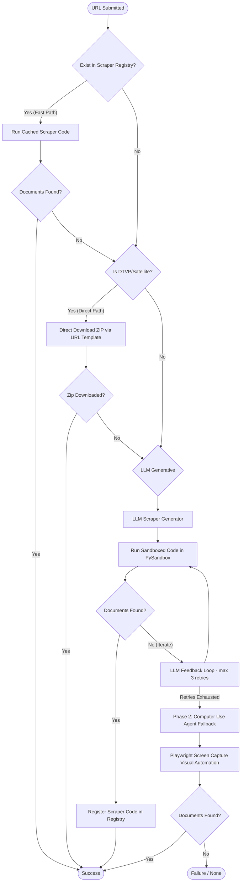

# Vergabepilot.AI ⚡
**Autonomous Agentic AI for Procurement Document Extraction & Cascade Pipeline**

*SoSe 2026 · CORE Research Group · in cooperation with Ciconia Systems GmbH*  
*Developed by: **Siddharth Patni***

---

## Executive Project Overview

Vergabepilot.AI is a highly optimized, production-ready, modular system designed to automate the scraping and download of public procurement tender documents across thousands of highly fragmented German and European Union portals. Instead of relying on brittle manual scrapers, the system features an intelligent **Agentic Cascade Pipeline** that dynamically degrades from low-cost cached strategies to highly advanced autonomous generative and visual agents.

### Core Achievements & Features
1. **Dynamic Cascade Scraper Loop**: Dynamically routes notice URLs through manual scripts, cached Python scrapers, deterministic builders, generative AI-synthesis, and visual browser fallback loops.
2. **Phase 1 LLM Scraper Generation & Sandbox**: Uses generative LLMs (Gemini, Claude, GPT) to read a portal's structure, synthesize custom Playwright code, validate it inside a sandboxed environment, and iteratively heal the code based on stdout/stderr logs.
3. **Phase 2 Visual Computer-Use Agents (CUA)**: Dispatches visual browser automation agents that interact with tender portals through mouse coordinates and keyboard input based on real-time screen captures—bypassing modern anti-scraping paywalls.
4. **Global HTML Filtering & Safe-Saves**: Guarantees that only actual tender documents (PDFs, ZIPs, Word files) are persistent in storage, automatically filtering false-positive HTML downloads at the pipeline level.
5. **Real-time Admin Monitor & Security Diagnostics**: A premium centralized ops command center showing pipeline metrics, strategy distributions, and real-time security threats (e.g., prompt injections, SSRF attempts, sandbox violations).

---

## 📐 System Phase Connections & Cascade Strategy

The cascade system is built on a fail-safe strategy prioritizing **speed, cost-efficiency, and resilience**:



### Strategy Hierarchy & Classification
* **Manual Scraper (`manual_scraper`)**: Pre-written, high-reliability legacy Python scripts mapped to specific high-traffic domains.
* **Existing Scraper (`existing_scraper`)**: Automatically saved scrapers generated in previous successful LLM scraper runs.
* **Deterministic DTVP (`deterministic_template`)**: Highly efficient URL construction for DTVP/Satellite Notice systems, constructing download URLs instantly without browser overhead or LLM costs.
* **LLM Scraper (`llm_generated_scraper`)**: Dynamic scraping script synthesized on-the-fly inside PySandbox via an LLM agent.
* **Computer Use Agent (`computer_use_agent`)**: The ultimate fallback. Visual agent capturing screenshots of page states and choosing visual actions.
* **Failure / None (`none`)**: Triggered when all steps are exhausted without downloading documents.

---

## Stack, APIs & LLM Models Used

Vergabepilot.AI supports a diverse suite of cutting-edge LLMs integrated via a standardized routing schema (`backend/app/core/llm.py`):

| LLM Model | Category | Primary Use Case |
|---|---|---|
| **Google Gemini 2.5 Flash Lite** | Core/Fast Scraper | Low-latency script synthesis, route discovery, and fast parsing. |
| **Google Gemini 2.5 Flash** | General Purpose | Default scraper builder and error diagnosis parser. |
| **Google Gemini 2.5 Pro** | Highly Analytical | Visual coordinate discovery for CUA, complex portal exploration. |
| **Anthropic Claude 3.5 Sonnet** | Premium Visual | Complex CUA screenshot-to-action reasoning loops. |
| **Anthropic Claude 3.5 Haiku** | Fast Visual | Lightweight visual CUA tasks. |
| **OpenAI GPT-4o** | High Capacity | Backup scraper generator and complex validation logic. |
| **OpenAI GPT-4o Mini** | Secondary Backup | Cost-effective fallback scraper generator. |

---

## How to Start the Server

The entire stack is containerized via Docker Compose, combining a FastAPI REST service, an async Celery worker pool, PostgreSQL, Redis, MinIO (object storage), and a premium Next.js 14 frontend.

### Prerequisites
* Docker & Docker Compose installed.
* Access to OpenRouter API key.

### Setup Steps
1. **Clone the Repository & Set Environment Variables**:
   ```bash
   cp .env.example .env
   ```
   Open the `.env` file and insert your active keys:
   ```env
   OPENROUTER_API_KEY=your_openrouter_api_key_here
   S3_BUCKET=vergabepilot-documents
   CELERY_BROKER_URL=redis://redis:6379/0
   ```

2. **Launch the Containerized Services**:
   ```bash
   docker compose up --build -d
   ```

3. **Verify running containers**:
   ```bash
   docker compose ps
   ```

### Access Points
* 🖥️ **Interactive Web Dashboard**: [http://localhost:3000](http://localhost:3000)
* 📖 **FastAPI Interactive Docs (Swagger)**: [http://localhost:8000/docs](http://localhost:8000/docs)
* 🗄️ **MinIO S3 Control Console**: [http://localhost:9001](http://localhost:9001) *(User: `minioadmin` / Pass: `minioadmin`)*

---

## Future Developer Guide: How to Extend the System

Developers looking to build upon Vergabepilot.AI can easily plug into our modular pipeline architecture:

### 1. Registering a New Manual Scraper
If you have written a high-reliability manual scraper for a specific domain (e.g., `vergabe.hessen.de`), register it as follows:
1. Put the scraper script logic inside `backend/app/phase0_manual/v1_reference.py`.
2. Map the domain to your script handler inside the manual scraper router in `backend/app/phase3_integration/pipeline.py`:
   ```python
   # Inside pipeline.py, manual scraper trigger section:
   if domain == "vergabe.hessen.de":
       return await run_manual_hessen_scraper(url, scratch, db)
   ```

### 2. Adding a New Deterministic Platform Template (DTVP Family)
If you discover a procurement platform family that uses fixed patterns:
1. Open `backend/app/phase3_integration/platform_classifier.py`.
2. Add the URL matches inside `_URL_PATTERNS` and the HTML matches in `_HTML_PATTERNS`.
3. Add the platform to the `DETERMINISTIC_PLATFORMS` set:
   ```python
   DETERMINISTIC_PLATFORMS = {"dtvp", "my_new_platform"}
   ```
4. Define the ZIP/archive path builder inside `build_download_url`:
   ```python
   if platform == "my_new_platform":
       return f"https://{domain}/download?tenderId={extract_id(url)}"
   ```

### 3. Modifying LLM Scraper Generation Prompts
To improve the accuracy of automatically generated Python/Playwright scrapers:
1. Open `backend/app/phase1_llm_scraper/prompts.py`.
2. Locate `SCRAPER_GENERATION_PROMPT` or `FEEDBACK_HEALING_PROMPT`.
3. Adjust instructions to guide how selectors are prioritized, or enforce specific waiting strategies inside the browser sandboxes.

---

Coursework — © 2026 ATP Team Vergabepilot-AI. Designed & refined by Siddharth Patni in cooperation with Ciconia Systems GmbH.
