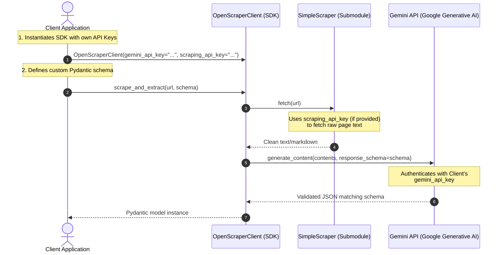

# Open-Source Reusable Scraper SDK (Proof of Concept)

This document provides a complete guide and architecture design for creating an importable Python library/module that scrapes websites and uses client-supplied API keys (e.g., for Gemini LLM, Firecrawl, or scraping proxies).

To make it easy for you to demonstrate this concept, we have created a ready-to-publish, fully functioning PoC package in your workspace:
📁 **[scripts/open-scraper-sdk/](file:///Users/siddharthpatni/vergabepilot-ai/scripts/open-scraper-sdk/)**

---

## 🏗️ Architecture Design

When designing an importable library where users use their own API keys, the golden rule is **dynamic client-side configuration**. Instead of binding credentials to a server-side state or configuration files, credentials flow from the client application directly through the library class constructor, with fallback to standard environment variables.

### How Credentials and Flow Work



---

## 📂 Created Files in Your Workspace

We have written the complete conceptual codebase for this open-source library inside your workspace under `scripts/open-scraper-sdk`. You can explore and edit these files directly:

1. **📄 [pyproject.toml](file:///Users/siddharthpatni/vergabepilot-ai/scripts/open-scraper-sdk/pyproject.toml)**: Standard package configuration using `hatchling` as the build system. Declares core dependencies (`requests`, `google-generativeai`, `pydantic`).
2. **📄 [src/open_scraper_sdk/\_\_init\_\_.py](file:///Users/siddharthpatni/vergabepilot-ai/scripts/open-scraper-sdk/src/open_scraper_sdk/__init__.py)**: Package entry point, exposing class definitions cleanly.
3. **📄 [src/open_scraper_sdk/client.py](file:///Users/siddharthpatni/vergabepilot-ai/scripts/open-scraper-sdk/src/open_scraper_sdk/client.py)**: Orchestrator client which receives the user's `gemini_api_key` and `scraping_api_key`.
4. **📄 [src/open_scraper_sdk/scraper.py](file:///Users/siddharthpatni/vergabepilot-ai/scripts/open-scraper-sdk/src/open_scraper_sdk/scraper.py)**: Handles raw page scraping, supporting standard requests, Firecrawl, or ScraperAPI.
5. **📄 [src/open_scraper_sdk/llm.py](file:///Users/siddharthpatni/vergabepilot-ai/scripts/open-scraper-sdk/src/open_scraper_sdk/llm.py)**: Configures `google-generativeai` with the client's key and runs structured extraction.
6. **📄 [examples/demo.py](file:///Users/siddharthpatni/vergabepilot-ai/scripts/open-scraper-sdk/examples/demo.py)**: A sample consumer script showing how someone who imports your library can easily run structured extraction.
7. **📄 [README.md](file:///Users/siddharthpatni/vergabepilot-ai/scripts/open-scraper-sdk/README.md)**: A gorgeous, production-ready documentation file for the project.

---

## 💡 Key Design Decisions & Best Practices

### 1. Dynamic API Key Resolution (Constructor + Env Var Fallback)
In [src/open_scraper_sdk/client.py](file:///Users/siddharthpatni/vergabepilot-ai/scripts/open-scraper-sdk/src/open_scraper_sdk/client.py), keys are parsed as follows:
```python
self.gemini_api_key = gemini_api_key or os.environ.get("GEMINI_API_KEY")
```
This is the standard API convention used by companies like OpenAI, Stripe, and Google. It provides maximum flexibility:
- **Quick start**: Just set an environment variable.
- **Advanced usage**: Pass keys programmatically in code (e.g. if building a multi-tenant SaaS app).

### 2. User-Defined Schemas via Pydantic
Rather than hardcoding *what* is extracted, we allow the client app to pass in their own **Pydantic Model**. Gemini reads the JSON schema derived from the Pydantic class to format the response. This makes your library general-purpose and highly reusable.

### 3. Serverless and Self-Contained
Because the code executes completely on the client machine using *their* network and *their* API accounts:
- You incur **zero hosting costs**.
- There is **no database storage** or privacy concerns regarding scraped data.
- It is incredibly safe to open-source since no private keys or proprietary server codes are contained within.

---

## 🚢 How to Share and Publish Your PoC

Since you want to make this concept public while keeping your main project (`vergabepilot-ai`) private, follow these simple steps to move this SDK into its own public repository:

### Step 1: Initialize a Separate Repository
Copy the folder out of your private project workspace to a new location on your computer (e.g., your Desktop or standard projects directory) and initialize Git:
```bash
# 1. Copy the folder to a new place
cp -r /Users/siddharthpatni/vergabepilot-ai/scripts/open-scraper-sdk ~/Desktop/open-scraper-sdk
cd ~/Desktop/open-scraper-sdk

# 2. Initialize a clean, public git repo
git init
git add .
git commit -m "initial release of open-scraper-sdk"
```

### Step 2: Publish to GitHub
1. Create a new **public** repository on your GitHub account named `open-scraper-sdk`.
2. Push your code:
```bash
git remote add origin https://github.com/YOUR_USERNAME/open-scraper-sdk.git
git branch -M main
git push -u origin main
```

### Step 3: Publish to PyPI (Python Package Index)
If you want others to be able to run `pip install open-scraper-sdk`, you can publish it to PyPI using `hatch` and `twine`:
```bash
# 1. Build the distribution packages (.whl and .tar.gz)
pip install build twine
python -m build

# 2. Upload to PyPI (requires a PyPI account and API token)
python -m twine upload dist/*
```
Once uploaded, anyone in the world can import and use your conceptual scraper with their own API keys!
