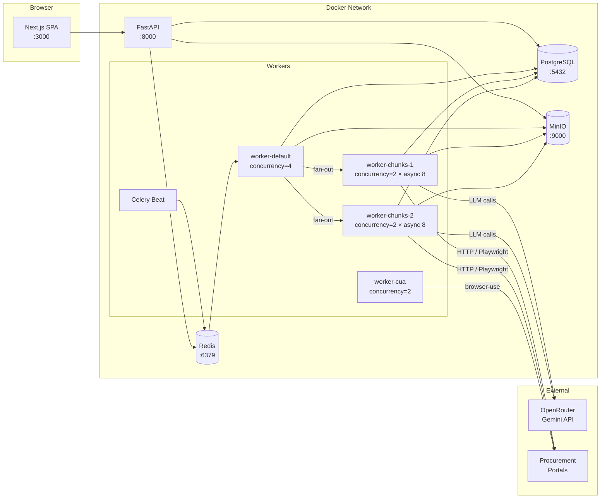
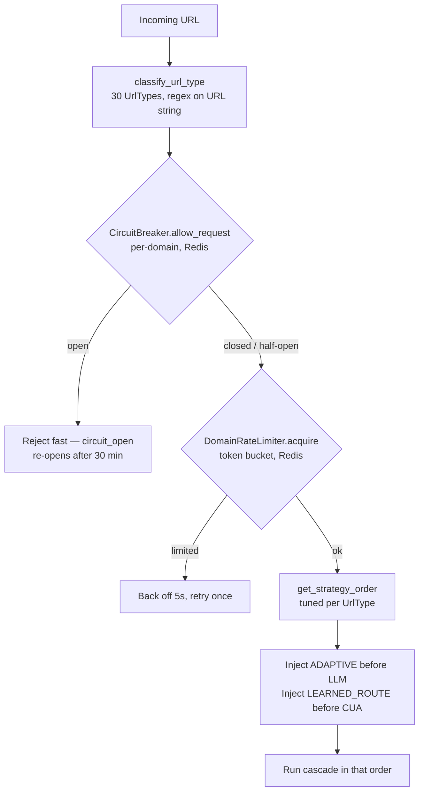
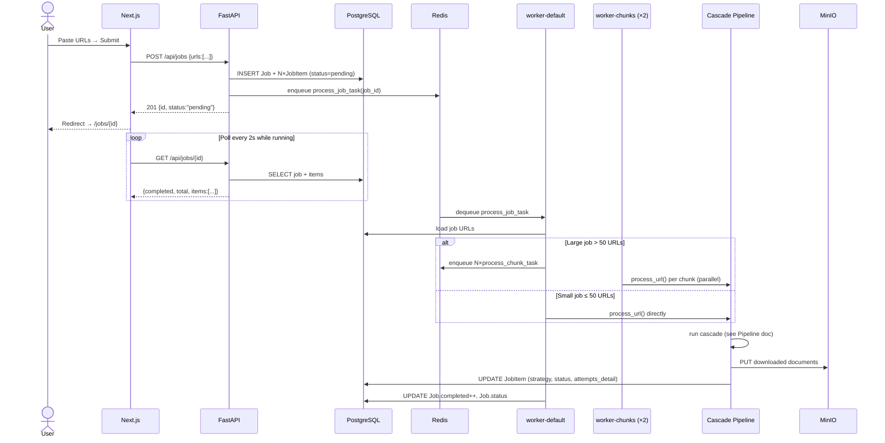
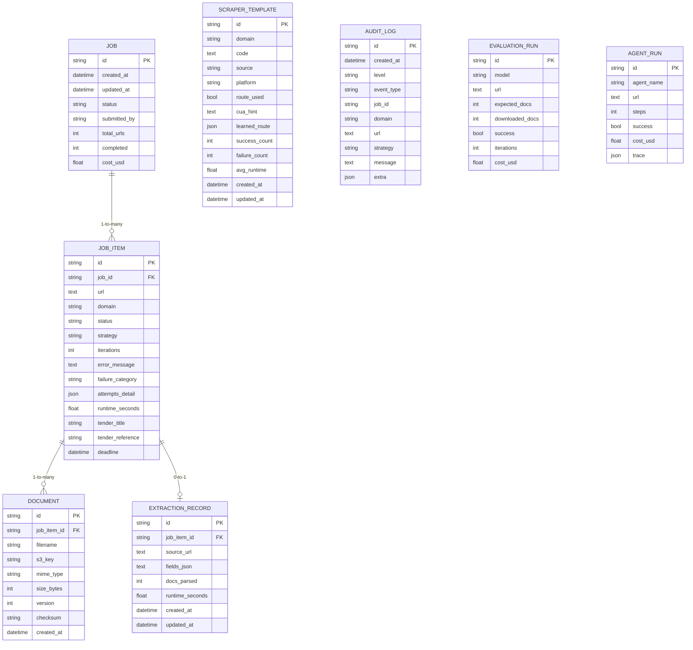
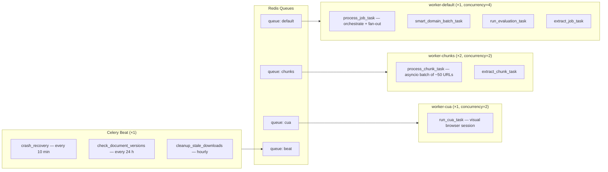
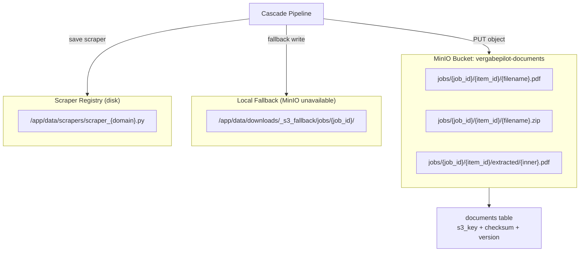
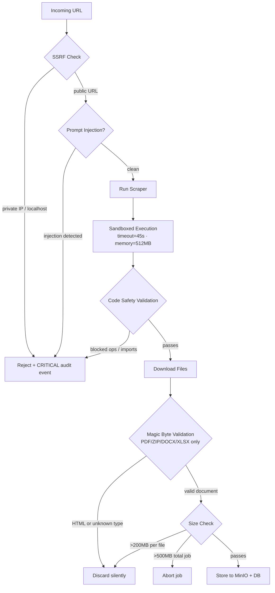

# Architecture — Vergabepilot.AI

## Table of Contents
1. [High-Level Overview](#1-high-level-overview)
2. [Component Diagram](#2-component-diagram)
3. [URL Intelligence & Resilience](#3-url-intelligence--resilience)
4. [Request Lifecycle](#4-request-lifecycle)
5. [Database Schema](#5-database-schema)
6. [Worker Architecture](#6-worker-architecture)
7. [Storage Architecture](#7-storage-architecture)
8. [Security Architecture](#8-security-architecture)
9. [Observability](#9-observability)

---

## 1. High-Level Overview

Vergabepilot.AI is a **multi-tier, event-driven system** built around an Agentic Cascade Pipeline. Every layer is independently scalable and isolated via Docker.

| Tier | Technology | Role |
|---|---|---|
| Presentation | Next.js 14 (App Router) | Real-time dashboard, job submission, public tender directory, analytics |
| API Gateway | FastAPI + Uvicorn (2 workers) | REST API, request routing, health probes |
| Task Queue | Celery + Redis | Async job orchestration, chunked fan-out to worker pools |
| URL Intelligence | `phase3_integration/url_intelligence.py` | Pre-classify every URL (30 portal types) + circuit breaker + rate limiter |
| Cascade Engine | Phase 0–3 Python modules | 7-strategy scraping cascade, tuned per URL type |
| Persistence | PostgreSQL 16 | Relational data (jobs, items, audit, scrapers, extractions) |
| Object Storage | MinIO (S3-compatible) | Downloaded procurement documents |
| LLM Provider | OpenRouter → Gemini 2.5 Flash Lite | Code generation, field extraction |

The **7-strategy cascade** (cheapest-first): `EXISTING → DETERMINISTIC → ADAPTIVE → LLM_GENERATED → LEARNED_ROUTE → CUA → MANUAL`. The exact order per URL is selected by the URL-intelligence layer — auth-gated portals skip the paid LLM entirely. See [PIPELINE.md](PIPELINE.md).



---

## 2. Component Diagram

### Backend Module Map

```mermaid
graph TB
    subgraph API["app/api — Route Handlers"]
        RJ[routes_jobs.py]
        RS[routes_scrapers.py]
        RD[routes_directory.py]
        RA[routes_admin.py]
        RAU[routes_audit.py]
        RE[routes_extractor.py]
        REV[routes_evaluation.py]
        RAG[routes_agents.py]
        RT[routes_tests.py]
    end

    subgraph Phase0["app/phase0_manual"]
        V1[v1_reference.py<br/>Strategy 7 — manual scraper]
    end

    subgraph Phase1["app/phase1_llm_scraper — Strategy 4"]
        GEN[generator.py — LLM prompt + code builder]
        SBX[executor.py — sandboxed runner]
        FBK[feedback_loop.py — iterative self-healing]
        VAL[validator.py — code safety + SSRF checks]
        DV[document_validator.py — real-doc checks]
        EVL[evaluator.py — benchmark runner]
        RLN[route_learner.py — route tracer]
    end

    subgraph Phase2["app/phase2_cua — Strategies 5 & 6"]
        PCA[browser_agent.py — Playwright CUA]
        BUA[browser_use_agent.py — browser-use CUA]
        ORC[orchestrator.py — agent dispatcher]
        RL2[route_learner.py — learn/replay CUA route]
    end

    subgraph Phase3["app/phase3_integration — cascade engine"]
        PPL[pipeline.py — cascade orchestrator]
        UIN[url_intelligence.py — 30 UrlTypes + breaker + limiter]
        ADP[adaptive_scraper.py — Strategy 3 universal heuristic]
        REG[scraper_registry.py — save/load scrapers + routes]
        DET[deterministic.py — Strategy 2 direct ZIP]
        PCF[platform_classifier.py — portal detection]
        OUT[outcomes.py — honest failure buckets]
        SEED[portal_directory_seed.py — 100 seed portals]
        VER[versioning.py — change tracking]
        FLB[fallback.py — next-strategy selector]
    end

    subgraph Core["app/core"]
        SEC[security.py — SSRF + injection + classify_error]
        STR[storage.py — MinIO S3 client]
        HTTP[http_client.py — retry + backoff + jitter]
        WH[web_harvest.py — multilingual harvest]
        RLM[ratelimit.py — per-IP API limiter]
        MET[metrics.py — Prometheus counters]
        ZXP[zip_expander.py — recursive ZIP handler]
    end

    subgraph Extractor["app/document_extractor"]
        EXT[extractor.py — orchestrator]
        FLD[field_extractor.py — German regex patterns]
        PAR[parsers.py — PDF/DOCX/XLSX text]
        DAT[dates.py — multi-format dates]
        SUM[summarizer.py — rule-based summary]
        LLM[llm_enhancer.py — Gemini field boost]
        RPT[report_builder.py — PDF/DOCX reports]
    end

    RJ --> PPL
    PPL --> UIN
    UIN --> V1 & DET & ADP & GEN & ORC & RL2 & REG
    PPL --> SEC & STR & OUT
    GEN --> SBX --> FBK
    ADP --> WH --> HTTP
    RD --> SEED
    EXT --> FLD & PAR & DAT & SUM & LLM & RPT
    RE --> EXT
```



### Frontend Page Map

```mermaid
graph TB
    subgraph Pages["app/ — Pages (Next.js App Router)"]
        PH[/ — Dashboard]
        PJ[/jobs — Job List]
        PJD["/jobs/[id] — Job Detail"]
        PDIR[/directory — Public Tender Directory]
        PLIB[/library — Document Library]
        PX[/extraction — Deep Extraction]
        PS[/scrapers — Scraper Registry]
        PA[/audit — Audit Log]
        PM[/admin — Health + Needs-Manual]
        PG[/agents — CUA Sessions]
        PV[/evaluation — LLM Benchmarks]
        PE[/excel — Excel Workspace]
        PT[/tests — Test Runner]
    end

    subgraph Shared["components/"]
        NAV[Navbar — sticky, theme toggle]
        JSF[JobSubmitForm — URL + CSV/Excel upload]
        SBG[StatusBadge — animated status pills]
        STC[StatCard — KPI tiles]
        TOS[Toast + ToastProvider]
        DSY[ui/index.tsx — Full Design System]
    end

    subgraph Lib["lib/"]
        AC[api.ts — fetcher with retry + backoff]
        HK[hooks.ts — useTheme, useDebounce]
        TY[types.ts — TypeScript interfaces]
        TH[theme.ts — design tokens]
    end

    PH --> JSF & AC
    PJ --> SBG & AC
    PJD --> SBG & DSY & TOS & AC
    PA --> TOS & AC
    PM --> TOS & AC
    NAV -.->|wraps all pages| PH
    TOS -.->|wraps all pages| PH
```

---

## 3. URL Intelligence & Resilience

Before the cascade runs, every URL passes through `phase3_integration/url_intelligence.py` — a pure, no-HTTP pre-classification layer that is the single biggest reliability win for large runs.



**URL types → strategy order (examples):**

| UrlType | Expected success | Strategy order (before injection) | Rationale |
|---|---|---|---|
| `SATELLITE` (DTVP) | ~93% | `DETERMINISTIC → EXISTING → MANUAL` | Direct ZIP URL — fastest, free; no LLM needed |
| `NETSERVER_PUB` | ~65% | `EXISTING → DETERMINISTIC → MANUAL → LLM → CUA` | Public docs, full cascade as backstop |
| `NETSERVER_AUTH` / `EVA_PORTAL` / `EVERGABE_DEEP` | ~5% | `EXISTING → CUA → MANUAL` | Login-gated — **skip LLM** (0% over hundreds of attempts) |
| `TED_EUROPA` | ~85% | `EXISTING → LLM → MANUAL → CUA` | Well-documented API, LLM generates cleanly |
| Well-structured public (UK/NL/BE/US/CA/AU/NZ/…) | ~65–80% | `EXISTING → LLM → MANUAL → CUA` | LLM-friendly structure |
| Complex public (FR/PL/ES/IT/IN/AFRICA/…) | ~55–70% | `EXISTING → MANUAL → LLM → CUA` | Try a manual reference before paying for LLM |
| `UNKNOWN` | ~35% | `EXISTING → DETERMINISTIC → LLM → CUA → MANUAL` | Full cascade; `ADAPTIVE` carries the country-agnostic load |

`ADAPTIVE` (free heuristic) is injected immediately before any paid `LLM_GENERATED` step, and `LEARNED_ROUTE` (cheap replay) immediately before any `CUA` step.

### Circuit Breaker

Per-domain, Redis-backed, shared across all workers. State machine: `CLOSED → (5 failures, or 3 for auth/captcha) → OPEN → (30 min) → HALF_OPEN → (probe success) → CLOSED`. Falls back to `CLOSED` (allow) if Redis is unavailable. Auth and CAPTCHA failures trip after only 3 attempts because no strategy fixes them without credentials.

### Domain Rate Limiter

Per-domain token bucket (max 4 concurrent requests / 30 s window) so 32 workers don't hammer a single portal into an IP ban. Also degrades gracefully (allow) when Redis is down.

### LLM Concurrency Controls

Two layers prevent the OpenRouter key from hitting concurrent-call limits during large runs:
- **Global semaphore** — caps simultaneous LLM generations per worker to `LLM_GLOBAL_CONCURRENCY`.
- **Domain dedup lock** — a Redis `NX` lock (`DOMAIN_LLM_LOCK_TTL`) so when many URLs share a domain, one worker generates the scraper while the others wait and reuse the result, instead of all calling the LLM.

---

## 4. Request Lifecycle

### Job Submission (Happy Path)



---

## 5. Database Schema



**Design Notes:**
- `AuditLog` is **append-only** — no UPDATE or DELETE, ever. Full event replay is always possible.
- `attempts_detail` is a JSON array on `JobItem` storing every strategy tried, its outcome, duration, and error. No extra join needed for the UI timeline.
- `ScraperTemplate.cua_hint` stores the CUA interaction trace as text — context for future LLM scraper generation on that domain. `ScraperTemplate.learned_route` stores a replayable navigation route distilled from a CUA-only success, served cheaply by the `LEARNED_ROUTE` strategy.
- `JobItem.tender_title / tender_reference / deadline` are a denormalized projection of the most-queried extracted fields (kept in sync by the deep extractor). A composite index `ix_job_items_directory(domain, status, deadline)` powers the public tender directory's "open & soonest-closing" queries without parsing JSON. `ExtractionRecord.fields_json` remains the source of truth.
- Alembic history: `baseline_schema` → `add_learned_route` → `add_tender_directory_fields`. Migrations run automatically on API startup.
- PostgreSQL connection pool: `pool_size=20, max_overflow=20` → 40 total connections, enough for the default 32 concurrent workers.

---

## 6. Worker Architecture

Four Redis queues isolate workloads so concurrency can be tuned independently. Reliability is configured for long-running jobs: `task_acks_late=True` (don't ack until a task completes — survives worker crashes), `task_reject_on_worker_lost=True` (re-queue if a worker dies mid-task), `worker_prefetch_multiplier=1` (never prefetch), `worker_max_tasks_per_child=200` (recycle to prevent memory leaks), `task_time_limit=7200` (2 h hard kill).



| Pool | Replicas | Celery concurrency | Inner asyncio | Concurrent URLs | Role |
|---|---|---|---|---|---|
| worker-default | 1 | 4 | — | — | Job orchestration, fan-out, evaluation, extraction jobs |
| worker-chunks | 2 | 2 | `JOB_CONCURRENCY=8` | **~32** | URL processing (main throughput) |
| worker-cua | 1 | 2 | — | 2 | Browser-heavy CUA sessions |
| beat | 1 | — | — | — | Periodic recovery / versioning / cleanup |

Concurrent-URL math: `2 replicas × 2 Celery slots × 8 asyncio = 32`. Each `process_chunk_task` handles up to `JOB_CHUNK_SIZE=50` URLs, processing `JOB_CONCURRENCY` of them at a time, and **skips already-`SUCCESS` items on retry** (job resumability).

Scale for more throughput:
```bash
# ~2× throughput → ~64 concurrent URLs
docker compose up --scale worker-chunks=4 -d
```

---

## 7. Storage Architecture



**Document versioning:** SHA-256 checksums detect portal updates. Changed files increment `Document.version` instead of overwriting, preserving history.

**ZIP expansion:** Recursive extraction up to depth 3, max 500 MB total, 200 MB per file. Path traversal is prevented by stripping `../` sequences.

---

## 8. Security Architecture



**Security layers in order:**
1. **SSRF guard** — private IP ranges and `localhost` blocked at URL parsing
2. **Prompt injection detection** — LLM inputs (URL path + fetched HTML) scanned for known injection patterns; fetched HTML is also sanitised before reaching the LLM
3. **Code validation** — generated Playwright code checked for disallowed imports/syscalls
4. **Sandbox execution** — subprocess with `ulimit` on memory + wall-clock timeout (`SANDBOX_TIMEOUT_SECONDS=45`, `SANDBOX_MEMORY_MB=512`)
5. **Magic byte validation** — file headers checked regardless of extension; HTML/unknown types discarded
6. **Size limits** — 200 MB per file, 500 MB per job; recursive ZIP expansion is bomb-safe
7. **Public API rate limiting** — the unauthenticated tender directory is per-IP rate limited (`PUBLIC_RATE_LIMIT_PER_MINUTE=60`) and exposes only a whitelist of tender-facing fields
8. **Secret validation** — startup aborts (in `production`/`staging`) if `SECRET_KEY` / MinIO credentials are missing or insecure defaults

---

## 9. Observability

### Prometheus Metrics (`GET /metrics`)

| Metric | Type | Labels | Captures |
|---|---|---|---|
| `vergabepilot_scrape_total` | Counter | `strategy`, `status` | Per-strategy success/failure |
| `vergabepilot_scrape_duration_seconds` | Histogram | `strategy` | Per-strategy latency |
| `vergabepilot_documents_downloaded_total` | Counter | — | Documents persisted |
| `vergabepilot_zip_expansions_total` / `..._files_extracted_total` | Counter | — | ZIP handling |
| `vergabepilot_http_retries_total` | Counter | — | Resilient HTTP retries |
| `vergabepilot_circuit_breaker_events_total` | Counter | `event` (trip/reset/half_open/reject) | Breaker state changes |
| `vergabepilot_rate_limit_hits_total` | Counter | — | Domain rate-limiter rejections |
| `vergabepilot_job_urls_processed_total` | Counter | — | URL throughput |

### Correlation IDs

Every log line emitted while processing an item carries a `trace_id=job:<job_id>:item:<item_id>` bound via structlog `contextvars` (`logger.bind_request_context` / `clear_request_context`), so the full lifecycle of any URL is greppable across workers.

### Honest Outcome Buckets

`phase3_integration/outcomes.py` collapses the ~27 fine-grained failure categories into 8 coarse buckets for triage. `/api/admin/stats` returns `outcome_buckets` + `needs_manual_count`; `/api/jobs/needs-manual` lists the items a human can resolve.

| Bucket | Label | Needs human? | Suggested action |
|---|---|---|---|
| `success` | Succeeded | — | — |
| `auth_gated` | Login / registration required | ✅ | Log in / supply credentials, then retry |
| `captcha` | CAPTCHA / bot block | ✅ | Clear the check in a real browser, then retry |
| `expired` | Expired or not found | — | Verify the tender is still open |
| `unreachable` | Unreachable (network / server) | — | Transient — retry later (breaker reopens) |
| `no_documents` | No documents found | — | Confirm docs are actually published |
| `blocked` | Blocked (security) | — | Review URL — blocked by SSRF/security guards |
| `error` | Error — needs investigation | — | Inspect error detail + audit trail |

### Audit Log Event Types

| Level | Event Type | Description |
|---|---|---|
| INFO | `system.startup` | API server started, DB schema synced |
| INFO | `pipeline.start` / `pipeline.url_classified` | Cascade started; URL type + chosen strategy order |
| INFO | `strategy.attempt` / `pipeline.success` | A strategy was tried / succeeded |
| INFO | `route_learner.learned` | A replayable CUA route was learned for a domain |
| WARNING | `strategy.failed` / `self_heal.triggered` | A strategy failed / moderate-risk auto-retry |
| WARNING | `circuit_breaker.tripped` / `rate_limiter.backoff` | Resilience guards engaged |
| ERROR | `pipeline.failure` | All applicable strategies exhausted |
| CRITICAL | `security.blocked_url` / `security.prompt_injection` | SSRF / injection detected and blocked |
| CRITICAL | `system.unhandled_exception` | Uncaught exception in API handler |

### Health Endpoints

| Endpoint | Checks | Use |
|---|---|---|
| `GET /health` | PostgreSQL connectivity | Liveness probe |
| `GET /ready` | PostgreSQL + Redis | Readiness probe (load balancer) |
| `GET /metrics` | Prometheus text format | Monitoring scrape |
