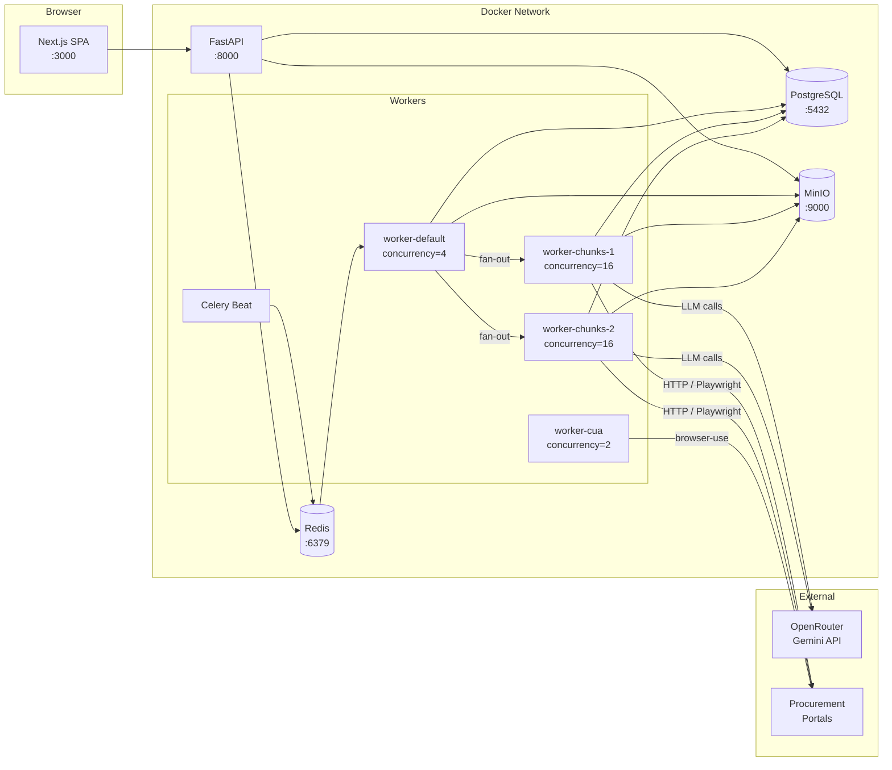
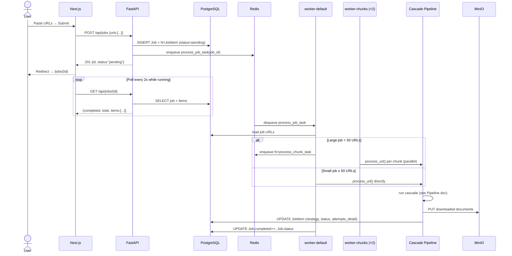
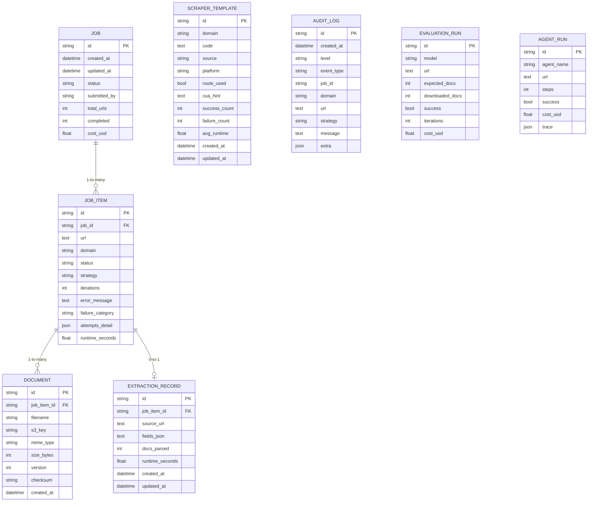
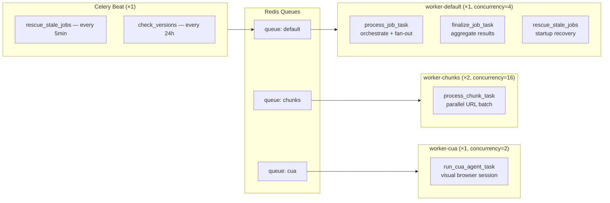
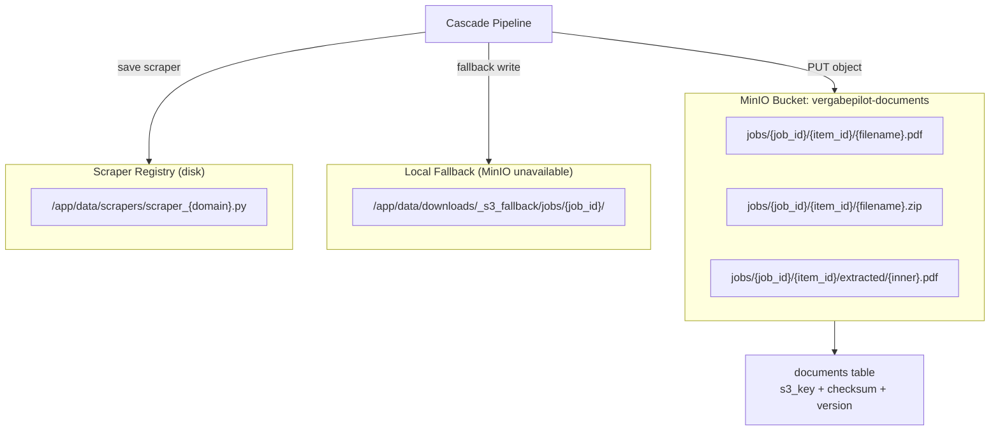
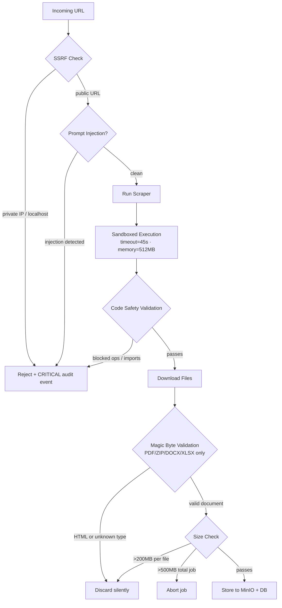

# Architecture — Vergabepilot.AI

## Table of Contents
1. [High-Level Overview](#1-high-level-overview)
2. [Component Diagram](#2-component-diagram)
3. [Request Lifecycle](#3-request-lifecycle)
4. [Database Schema](#4-database-schema)
5. [Worker Architecture](#5-worker-architecture)
6. [Storage Architecture](#6-storage-architecture)
7. [Security Architecture](#7-security-architecture)
8. [Observability](#8-observability)

---

## 1. High-Level Overview

Vergabepilot.AI is a **multi-tier, event-driven system** built around an Agentic Cascade Pipeline. Every layer is independently scalable and isolated via Docker.

| Tier | Technology | Role |
|---|---|---|
| Presentation | Next.js 14 (App Router) | Real-time dashboard, job submission, analytics |
| API Gateway | FastAPI + Uvicorn (2 workers) | REST API, request routing, health probes |
| Task Queue | Celery + Redis | Async job orchestration, fan-out to worker pools |
| Cascade Engine | Phase 0–3 Python modules | Scraping strategy execution |
| Persistence | PostgreSQL 16 | Relational data (jobs, items, audit, scrapers) |
| Object Storage | MinIO (S3-compatible) | Downloaded procurement documents |
| LLM Provider | OpenRouter → Gemini 2.5 Flash Lite | Code generation, field extraction |



---

## 2. Component Diagram

### Backend Module Map

```mermaid
graph TB
    subgraph API["app/api — Route Handlers"]
        RJ[routes_jobs.py]
        RS[routes_scrapers.py]
        RA[routes_admin.py]
        RAU[routes_audit.py]
        RE[routes_extractor.py]
        REV[routes_evaluation.py]
        RAG[routes_agents.py]
        RT[routes_tests.py]
    end

    subgraph Phase0["app/phase0_manual"]
        V1[v1_reference.py<br/>Playwright manual scraper]
    end

    subgraph Phase1["app/phase1_llm_scraper"]
        GEN[generator.py — LLM prompt + code builder]
        SBX[executor.py — sandboxed PySandbox runner]
        FBK[feedback_loop.py — iterative self-healing]
        VAL[validator.py — code safety + SSRF checks]
        EVL[evaluator.py — benchmark runner]
        RLN[route_learner.py — CUA trace recorder]
    end

    subgraph Phase2["app/phase2_cua"]
        PCA[browser_agent.py — Playwright CUA]
        BUA[browser_use_agent.py — browser-use CUA]
        ORC[orchestrator.py — agent dispatcher]
    end

    subgraph Phase3["app/phase3_integration"]
        PPL[pipeline.py — cascade orchestrator]
        REG[scraper_registry.py — save/load scrapers]
        DET[deterministic.py — direct ZIP download]
        PCF[platform_classifier.py — portal detection]
        VER[versioning.py — document change tracking]
        FLB[fallback.py — next-strategy selector]
    end

    subgraph Core["app/core"]
        SEC[security.py — SSRF + injection guards]
        STR[storage.py — MinIO S3 client]
        MET[metrics.py — Prometheus counters]
        ZXP[zip_expander.py — recursive ZIP handler]
    end

    subgraph Extractor["app/document_extractor"]
        EXT[extractor.py — orchestrator]
        FLD[field_extractor.py — 50+ regex patterns]
        PAR[parsers.py — PDF/DOCX/XLSX text extraction]
        LLM[llm_enhancer.py — Gemini field boost]
        RPT[report_builder.py — PDF/DOCX report gen]
    end

    RJ --> PPL
    PPL --> V1 & GEN & DET & ORC & REG & SEC & STR
    GEN --> SBX --> FBK
    EXT --> FLD & PAR & LLM & RPT
    RE --> EXT
```



### Frontend Page Map

```mermaid
graph TB
    subgraph Pages["app/ — Pages (Next.js App Router)"]
        PH[/ — Dashboard]
        PJ[/jobs — Job List]
        PJD["/jobs/[id] — Job Detail"]
        PX[/extraction — Deep Extraction]
        PS[/scrapers — Scraper Registry]
        PA[/audit — Audit Log]
        PM[/admin — System Health]
        PG[/agents — CUA Sessions]
        PV[/evaluation — LLM Benchmarks]
        PE[/excel — Excel Workspace]
        PT[/tests — Test Runner]
        P4[/not-found — 404 Page]
    end

    subgraph Shared["components/"]
        NAV[Navbar — sticky, theme toggle]
        JSF[JobSubmitForm — URL + file upload]
        SBG[StatusBadge — animated status pills]
        TOS[Toast + ToastProvider]
        DSY[ui/index.tsx — Full Design System]
    end

    subgraph Lib["lib/"]
        AC[api.ts — fetcher with retry + backoff]
        HK[hooks.ts — useTheme, useDebounce]
        TY[types.ts — TypeScript interfaces]
        TH[theme.ts — design tokens]
    end

    PH --> JSF & AC
    PJ --> SBG & AC
    PJD --> SBG & DSY & TOS & AC
    PA --> TOS & AC
    PM --> TOS & AC
    NAV -.->|wraps all pages| PH
    TOS -.->|wraps all pages| PH
```

---

## 3. Request Lifecycle

### Job Submission (Happy Path)



---

## 4. Database Schema



**Design Notes:**
- `AuditLog` is **append-only** — no UPDATE or DELETE, ever. Full event replay is always possible.
- `attempts_detail` is a JSON array on `JobItem` storing every strategy tried, its outcome, duration, and error. No extra join needed for the UI timeline.
- `ScraperTemplate.cua_hint` stores the CUA interaction trace as text, used as additional context for future LLM scraper generation on that domain.
- PostgreSQL connection pool: `pool_size=20, max_overflow=20` → 40 total connections, enough for 32 concurrent workers.

---

## 5. Worker Architecture



| Pool | Replicas | Concurrency | Total slots | Role |
|---|---|---|---|---|
| worker-default | 1 | 4 | 4 | Job orchestration, fan-out |
| worker-chunks | 2 | 16 | **32** | URL processing (main throughput) |
| worker-cua | 1 | 2 | 2 | Browser-heavy CUA sessions |

Scale for more throughput:
```bash
# Double throughput to 64 simultaneous URLs
docker compose up --scale worker-chunks=4 -d
```

---

## 6. Storage Architecture



**Document versioning:** SHA-256 checksums detect portal updates. Changed files increment `Document.version` instead of overwriting, preserving history.

**ZIP expansion:** Recursive extraction up to depth 3, max 500 MB total, 200 MB per file. Path traversal is prevented by stripping `../` sequences.

---

## 7. Security Architecture



**Security layers in order:**
1. **SSRF guard** — private IP ranges and `localhost` blocked at URL parsing
2. **Prompt injection detection** — LLM inputs scanned for known injection patterns
3. **Code validation** — generated Playwright code checked for disallowed imports/syscalls
4. **Sandbox execution** — subprocess with `ulimit` on memory + wall-clock timeout
5. **Magic byte validation** — file headers checked regardless of extension
6. **Size limits** — 200 MB per file, 500 MB per job
7. **Secret validation** — startup aborts if `SECRET_KEY` / MinIO credentials are insecure defaults

---

## 8. Observability

### Prometheus Metrics (`GET /metrics`)

| Metric | Type | Labels |
|---|---|---|
| `vergabepilot_scrape_total` | Counter | `strategy`, `status` |
| `vergabepilot_scrape_duration_seconds` | Histogram | `strategy` |
| `vergabepilot_documents_downloaded_total` | Counter | `domain` |
| `vergabepilot_zip_expansions_total` | Counter | — |
| `vergabepilot_llm_generations_total` | Counter | `model`, `status` |
| `vergabepilot_active_jobs` | Gauge | — |
| `vergabepilot_scraper_registry_size` | Gauge | — |
| `vergabepilot_extraction_runs_total` | Counter | `status` |

### Audit Log Event Types

| Level | Event Type | Description |
|---|---|---|
| INFO | `system.startup` | API server started, DB schema synced |
| INFO | `pipeline.start` | Cascade started for one URL |
| INFO | `strategy.success` | A strategy downloaded documents |
| INFO | `scraper.saved` | New scraper registered |
| INFO | `extraction.complete` | Document fields extracted |
| WARNING | `strategy.failure` | A strategy failed; cascade continues |
| ERROR | `pipeline.all_failed` | All 5 strategies exhausted |
| CRITICAL | `security.ssrf_blocked` | SSRF attempt detected and blocked |
| CRITICAL | `security.prompt_injection` | Injection in LLM input detected |
| CRITICAL | `system.unhandled_exception` | Uncaught exception in API handler |

### Health Endpoints

| Endpoint | Checks | Use |
|---|---|---|
| `GET /health` | PostgreSQL connectivity | Liveness probe |
| `GET /ready` | PostgreSQL + Redis | Readiness probe (load balancer) |
| `GET /metrics` | Prometheus text format | Monitoring scrape |
