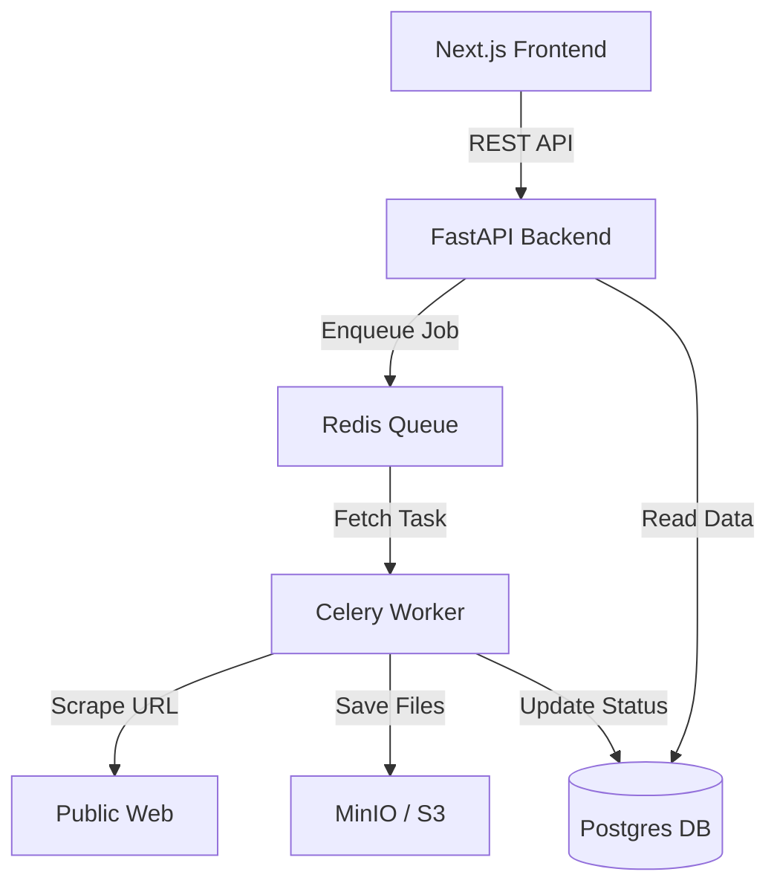

# System Connections Guide

This document details every connection and data flow within Vergabepilot.AI.

## Architecture Overview

Vergabepilot.AI is built as a distributed system with a React/Next.js frontend, a FastAPI backend, and Celery workers for asynchronous scraping tasks.

## Internal Connections

### 1. Frontend <-> Backend
- **Protocol**: HTTP/HTTPS (REST)
- **Path Mapping**: The Next.js `next.config.js` rewrites `/api/backend/*` to the FastAPI service URL.
- **Client**: `frontend/lib/api.ts` provides `fetcher`, `postJSON`, and `postMultipart` helpers.
- **Endpoints**:
    - `POST /api/jobs`: Start a new scraping job with manual URLs.
    - `POST /api/jobs/upload`: Start a bulk job via CSV/Excel upload.
    - `GET /api/jobs/{id}`: Poll job status and item progress.
    - `GET /api/scrapers`: Manage the Phase 3 scraper registry.

### 2. Backend <-> Database (Postgres)
- **ORM**: SQLAlchemy 2.0
- **Connection**: Managed via `backend/app/database.py`.
- **Registry**: `ScraperTemplate` rows in Phase 3 are stored here to be reused for specific domains.

### 3. Backend <-> Task Queue (Redis/Celery)
- **Broker**: Redis
- **Task Definition**: `backend/app/workers/tasks.py`.
- **Trigger**: When a Job is created, `process_job_task.delay(job_id)` is called.

### 4. Scraping Cascade (The "Brain")
Located in `backend/app/phase3_integration/pipeline.py`, the system attempts strategies in this order:

1.  **Manual (Phase 0)**: Uses `v1_reference.py` — a robust, human-authored Playwright scraper.
2.  **Existing (Phase 3)**: Looks up a verified scraper for the specific domain in the DB registry.
3.  **LLM-Generated (Phase 1)**: If no manual or existing scraper works, an LLM (GPT-4/Claude) generates code on-the-fly, validates it in a sandbox, and executes it.
4.  **CUA (Phase 2)**: Falls back to a Computer-Use Agent that "sees" the browser and clicks like a human if code generation fails.

### 5. Storage (MinIO)
- **Wrapper**: `backend/app/core/storage.py`
- **Logic**: Downloaded files are initially saved to a temporary local directory, then uploaded to MinIO.
- **Metadata**: Each file is tracked as a `Document` record linked to a `JobItem`.

## Key Files for Connection logic
- `backend/app/main.py`: Entry point where all routes are wired.
- `backend/app/phase3_integration/pipeline.py`: The orchestrator for the strategy cascade.
- `frontend/lib/api.ts`: API client for the UI.
- `docker-compose.yml`: Defines the network and environment connections for all services.
