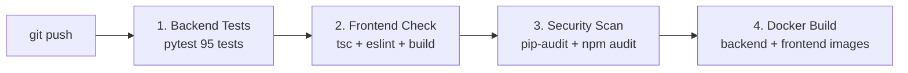

# Development Guide — Vergabepilot.AI

## Table of Contents
1. [Local Setup (without Docker)](#1-local-setup-without-docker)
2. [Running Tests](#2-running-tests)
3. [Project Conventions](#3-project-conventions)
4. [Adding a New API Route](#4-adding-a-new-api-route)
5. [Adding a Manual Domain Scraper](#5-adding-a-manual-domain-scraper)
6. [Frontend Development](#6-frontend-development)
7. [LLM Configuration](#7-llm-configuration)
8. [CI/CD Pipeline](#8-cicd-pipeline)

---

## 1. Local Setup (without Docker)

For fast iteration on the backend, run the API and one worker directly on your machine.

### Backend

```bash
cd backend

# Create and activate virtual environment
python3 -m venv .venv
source .venv/bin/activate

# Install dependencies
pip install -r requirements.txt

# Install Playwright browsers (for scraper execution)
python -m playwright install chromium

# Configure environment
cp ../.env.example ../.env
# Edit .env with at minimum:
#   DATABASE_URL=sqlite:///./vergabepilot.db
#   SECRET_KEY=any-32-char-string-for-dev
#   MINIO_ROOT_USER=dev
#   MINIO_ROOT_PASSWORD=devpassword

# Start the API
uvicorn app.main:app --reload --host 0.0.0.0 --port 8000

# In a second terminal — start a worker
celery -A app.workers.celery_app worker --queues=default,chunks --concurrency=4 --loglevel=info
```

### Frontend

```bash
cd frontend

# Install dependencies
npm install

# Set API URL (dev mode proxies to localhost:8000)
echo 'NEXT_PUBLIC_API_URL=http://localhost:8000' > .env.local

# Start Next.js dev server with hot reload
npm run dev
```

Dashboard: `http://localhost:3000`

---

## 2. Running Tests

### Backend Tests (pytest)

```bash
cd backend

# Run full test suite
pytest tests/ -v

# Run specific test file
pytest tests/test_phase3.py -v

# Run with coverage report
pytest tests/ --cov=app --cov-report=term-missing

# Skip browser-dependent tests (CI-safe)
pytest tests/ -v --ignore=tests/test_phase2.py
```

**Current test suite:** 95 tests across 7 files

| File | Tests | Coverage |
|---|---|---|
| `test_document_validator.py` | 25 | Document validation + magic bytes |
| `test_phase1.py` | 7 | LLM scraper generation + sandbox |
| `test_phase2.py` | 4 | CUA agent action space |
| `test_phase3.py` | 8 | Cascade pipeline + strategy routing |
| `test_platform_classifier.py` | 22 | Portal detection + URL classification |
| `test_route_and_deterministic.py` | 15 | Route learning + direct download |
| `test_zip_expansion.py` | 14 | ZIP extraction + bomb protection |

### Tender Extractor Tests (separate module)

```bash
cd tender_extractor

pytest tests/ -v
# 28 tests: date parser, value parser, field parser, rule summarizer, pipeline
```

### Frontend Type Check + Lint

```bash
cd frontend

npx tsc --noEmit    # TypeScript type check
npm run lint        # ESLint
npm run build       # Full production build (fastest full check)
```

---

## 3. Project Conventions

### Python Style

- **Type hints everywhere.** All function parameters and return types annotated.
- **Docstrings on all public functions** — one-paragraph description of the algorithm.
- **No bare `except:`** — always catch specific exceptions or use `except Exception as e`.
- **Log structured events, not strings:**
  ```python
  # Good
  log.info("strategy.success", domain=domain, docs=len(files), duration_s=elapsed)

  # Bad
  log.info(f"Downloaded {len(files)} files from {domain} in {elapsed}s")
  ```
- **Never read `os.environ` directly** — import `settings` from `app.config`.
- **One bad file never kills the batch** — wrap per-file operations in `try/except`.

### TypeScript Style

- **No `any` types** — use proper interfaces from `lib/types.ts`.
- **No `alert()` or `confirm()`** — use `useToast()` from `components/Toast`.
- **No inline `onMouseEnter/Leave` style mutations** — use CSS classes.
- **Hooks before any conditional returns** — rules-of-hooks compliance.
- **`useEffect` for side effects, `useMemo` for pure computation** only.

### Git Conventions

```
feat: add new feature
fix: bug fix
chore: tooling, dependencies, config
refactor: code restructure without behaviour change
test: add or update tests
docs: documentation only
```

---

## 4. Adding a New API Route

1. **Create or edit the route file** in `backend/app/api/routes_*.py`:

```python
# backend/app/api/routes_jobs.py (example addition)
@router.get("/{job_id}/my-new-endpoint")
def my_new_endpoint(job_id: str, db: Session = Depends(get_db)):
    """Return something useful for a job."""
    job = db.query(Job).filter(Job.id == job_id).first()
    if not job:
        raise HTTPException(status_code=404, detail="Job not found")
    return {"job_id": job_id, "something": "value"}
```

2. **Register the router** in `backend/app/main.py` (already done for existing routers).

3. **Add TypeScript type** in `frontend/lib/types.ts` if the response shape is new.

4. **Call from frontend** using the `api()` helper:

```typescript
const result = await fetcher(api(`/jobs/${id}/my-new-endpoint`));
```

5. **Write a test** in `backend/tests/`:

```python
def test_my_new_endpoint(client, db):
    job = create_test_job(db)
    r = client.get(f"/api/jobs/{job.id}/my-new-endpoint")
    assert r.status_code == 200
    assert r.json()["job_id"] == job.id
```

---

## 5. Adding a Manual Domain Scraper

For high-volume domains that need a hand-crafted scraper, add a file to `data/scrapers/`:

```python
# data/scrapers/scraper_myportal.de.py
"""
Manual scraper for myportal.de.
Strategy: click "Download All" → intercept ZIP download.
"""
import asyncio
from playwright.async_api import async_playwright

async def scrape(url: str, download_dir: str) -> list[str]:
    """
    Entry point called by the cascade pipeline.
    Must return a list of absolute file paths to downloaded documents.
    """
    downloaded = []
    async with async_playwright() as p:
        browser = await p.chromium.launch()
        page = await browser.new_page()
        await page.goto(url, timeout=30000)

        # Accept cookies if present
        try:
            await page.click("#cookie-accept", timeout=3000)
        except Exception:
            pass

        # Click Download All
        async with page.expect_download() as dl_info:
            await page.click('button:has-text("Alle herunterladen")')
        download = await dl_info.value
        path = f"{download_dir}/{download.suggested_filename}"
        await download.save_as(path)
        downloaded.append(path)

        await browser.close()
    return downloaded
```

**Naming convention:** `scraper_{domain}.py` where `{domain}` is the registered hostname (e.g. `scraper_dtvp.de.py`).

The scraper registry automatically seeds from this directory on startup. No DB changes needed.

---

## 6. Frontend Development

### Design System

All UI primitives are in `frontend/components/ui/index.tsx`. Import from there:

```tsx
import { Button, Card, Modal, Tabs, KpiCard, Alert } from "@/components/ui";
```

**Available components:** `Button`, `Badge`, `Card`, `CardHeader`, `Input`, `Skeleton`, `SkeletonCard`, `Progress`, `Alert`, `Spinner`, `Empty`, `Tabs`, `KpiCard`, `SectionHeader`, `Modal`, `Tooltip`, `SearchInput`, `LoadingPage`, `Divider`, `CodeBlock`

### Toast Notifications

Never use `alert()`. Use the toast context:

```tsx
import { useToast } from "@/components/Toast";

function MyComponent() {
  const toast = useToast();

  async function doAction() {
    try {
      await api.doSomething();
      toast.success("Done!", "Action completed successfully");
    } catch (e: any) {
      toast.error("Failed", e?.message);
    }
  }
}
```

### Dark Mode

The design system uses CSS variables. Always use them instead of hardcoded colours:

```tsx
// Good
style={{ color: "var(--fg)", background: "var(--bg-elevated)" }}

// Bad — breaks in dark mode
style={{ color: "#0f172a", background: "#ffffff" }}
```

**Available CSS variables:**

| Variable | Light | Dark |
|---|---|---|
| `--bg` | `#f8fafc` | `#0a0a0f` |
| `--bg-elevated` | `#ffffff` | `#111118` |
| `--bg-subtle` | `#f1f5f9` | `#17171f` |
| `--fg` | `#0f172a` | `#f0f0ff` |
| `--fg-muted` | `#475569` | `#9191b0` |
| `--fg-subtle` | `#94a3b8` | `#5a5a78` |
| `--brand` | `#4f46e5` | `#6366f1` |
| `--border` | `#e2e8f0` | `#1f1f2d` |

**Gradient backgrounds with white:** If you add a gradient that includes white (`via-white`, `to-white`), it will break in dark mode. Use solid CSS variable backgrounds instead, or note that our globals.css auto-fixes `bg-white + bg-gradient-to-*` combinations.

### Data Fetching

Use SWR for all server state. Smart polling is already configured:

```tsx
// Simple fetch
const { data, isLoading } = useSWR(api("/endpoint"), fetcher);

// Conditional polling
const { data } = useSWR(api("/jobs"), fetcher, {
  refreshInterval: (data) =>
    data?.some((j) => j.status === "running") ? 3000 : 0,
});
```

---

## 7. LLM Configuration

All three LLM model slots (primary, fallback, vision) default to `google/gemini-2.5-flash-lite` which runs on the **free tier** of OpenRouter.

### Getting an OpenRouter API Key

1. Go to [openrouter.ai](https://openrouter.ai)
2. Sign up and create an API key
3. Add to `.env`: `OPENROUTER_API_KEY=sk-or-v1-...`
4. Free models (including Gemini Flash Lite) require no billing setup

### Switching Models

In `.env`:
```env
LLM_MODEL_PRIMARY=google/gemini-2.5-flash-lite   # default
LLM_MODEL_PRIMARY=google/gemini-2.5-flash         # better quality, still cheap
LLM_MODEL_PRIMARY=anthropic/claude-haiku-4-5      # alternative
```

Or override per-job in the UI's "LLM Model" dropdown when submitting.

### Cost Tracking

Every LLM call's cost is tracked in `Job.cost_usd` and displayed in the dashboard. The audit log records each generation with model and token counts.

---

## 8. CI/CD Pipeline

The GitHub Actions pipeline at `.github/workflows/ci.yml` runs on every push and PR to `main`.

### Stages



| Stage | What it checks |
|---|---|
| **Backend Tests** | All 95 pytest tests with SQLite, no external deps |
| **Frontend Check** | TypeScript types, ESLint rules, full Next.js build |
| **Security Scan** | Python CVEs (pip-audit), Node CVEs (npm audit) |
| **Docker Build** | Images build successfully end-to-end |

### Running CI Locally

```bash
# Simulate backend CI
cd backend
DATABASE_URL=sqlite:///./test.db \
OPENROUTER_API_KEY="" \
SECRET_KEY="test-secret-key-for-testing-only-32-chars" \
MINIO_ROOT_USER=testuser \
MINIO_ROOT_PASSWORD=testpassword \
pytest tests/ -v

# Simulate frontend CI
cd frontend
npx tsc --noEmit
npm run lint
npm run build
```
