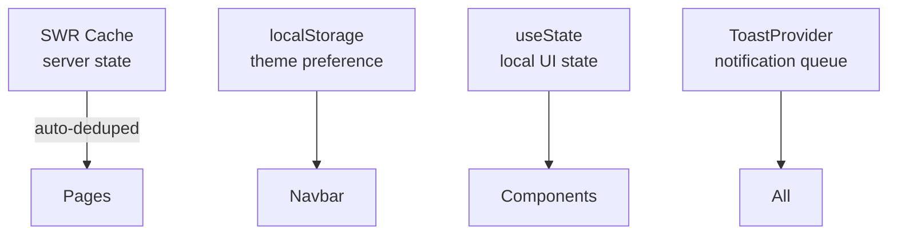

# Frontend Guide — Vergabepilot.AI

## Table of Contents
1. [Page Overview](#1-page-overview)
2. [Component Library](#2-component-library)
3. [Design System](#3-design-system)
4. [Data Fetching](#4-data-fetching)
5. [Dark Mode System](#5-dark-mode-system)
6. [State Management](#6-state-management)
7. [TypeScript Types](#7-typescript-types)

---

## 1. Page Overview

All pages use Next.js 14 App Router with `"use client"` for interactive pages.

```mermaid
graph LR
    subgraph Navigation
        NAV[Navbar — sticky, theme toggle, mobile drawer]
    end

    subgraph Pages
        P1["/ — Dashboard<br/>Job submit + KPIs + Strategy chart"]
        P2["/jobs — Job List<br/>Search, filter, progress pills"]
        P3["/jobs/[id] — Job Detail<br/>Cascade trail, docs, extraction"]
        P4["/extraction — Deep Extraction<br/>Field extract + PDF/DOCX report"]
        P5["/scrapers — Scraper Registry<br/>Generate + manage scrapers"]
        P6["/audit — Audit Log<br/>Searchable event stream"]
        P7["/admin — System Health<br/>Error breakdown + controls"]
        P8["/agents — CUA Sessions<br/>Agent leaderboard + live feed"]
        P9["/evaluation — Benchmarks<br/>LLM accuracy comparison"]
        P10["/excel — Excel Workspace<br/>Edit procurement spreadsheets"]
        P11["/tests — Test Runner<br/>Run backend test suite from UI"]
    end

    NAV --> Pages
```



### Page-by-Page Summary

| Page | Route | Key Components | Polling |
|---|---|---|---|
| Dashboard | `/` | `JobSubmitForm`, `KpiCard`, Recharts `BarChart`, `RecentJobs` | 5s active / 30s idle |
| Jobs | `/jobs` | `StatusBadge`, `SearchInput`, `Tabs`, `ProgressPill` | 3s active / 0 idle |
| Job Detail | `/jobs/[id]` | `CascadeTrail`, `AttemptTimeline`, `ExtractionPanel`, `DomainSection` | 2s active / 0 idle |
| Extraction | `/extraction` | `ExtractionCard`, `TriggerPanel`, `ExtractionRecordsList` | 15s |
| Scrapers | `/scrapers` | Route learn form, scraper table with expandable code | 8s |
| Audit | `/audit` | `AuditRow`, level filter, `useSearchParams` | 6s |
| Admin | `/admin` | Error breakdown, Recharts `PieChart`, system controls | 10s |
| Agents | `/agents` | CUA leaderboard, live execution feed | 6s |
| Evaluation | `/evaluation` | Model comparison table, strategy chart | 10s |
| Excel | `/excel` | IndexedDB, `react-window` virtual list, XLSX export | — |
| Tests | `/tests` | Test suite selector, live output streaming | — |

---

## 2. Component Library

All shared UI is in `components/ui/index.tsx`. Import directly:

```tsx
import {
  Button, Badge, Card, CardHeader, Input, Skeleton, SkeletonCard,
  Progress, Alert, Spinner, Empty, Tabs, KpiCard, SectionHeader,
  Modal, Tooltip, SearchInput, LoadingPage, Divider, CodeBlock
} from "@/components/ui";
```

### Button

```tsx
<Button variant="primary" size="sm" loading={busy} onClick={handleClick}>
  Submit
</Button>
```

| Prop | Values | Default |
|---|---|---|
| `variant` | `primary` `secondary` `ghost` `danger` `outline` | `secondary` |
| `size` | `xs` `sm` `md` `lg` `icon` | `md` |
| `loading` | `boolean` | `false` |

### KpiCard

```tsx
<KpiCard
  label="Total Jobs"
  value={stats?.jobs ?? 0}
  icon={<Activity className="w-5 h-5" />}
  sub="All time"
  color="brand"
  loading={isLoading}
/>
```

| `color` | Visual |
|---|---|
| `default` | Neutral |
| `brand` | Indigo |
| `success` | Emerald |
| `warning` | Amber |
| `error` | Rose |

### Modal

```tsx
<Modal
  open={showModal}
  onClose={() => setShowModal(false)}
  title="Confirm Action"
  footer={<Button variant="danger" onClick={handleConfirm}>Confirm</Button>}
>
  <p>Are you sure you want to delete this job?</p>
</Modal>
```

Features: Escape key to close, click-outside to close, focus trap, aria-modal.

### Tabs

```tsx
const tabs = [
  { id: "all", label: "All", count: jobs?.length },
  { id: "active", label: "Active", count: activeCount },
];

<Tabs tabs={tabs} active={activeTab} onChange={setActiveTab} />
```

### Alert

```tsx
<Alert variant="error" title="Connection Failed">
  Could not reach the API server. Check your network.
</Alert>
```

| `variant` | Icon | Colour |
|---|---|---|
| `info` | Info | Blue |
| `success` | CheckCircle | Emerald |
| `warning` | AlertTriangle | Amber |
| `error` | AlertCircle | Rose |

### Toast

```tsx
import { useToast } from "@/components/Toast";

const toast = useToast();
toast.success("Saved", "Changes saved successfully");
toast.error("Failed", error.message);
toast.warning("Column exists");
toast.info("Processing…");
```

Never use `alert()` or `window.alert()` — use `toast.error()`.

---

## 3. Design System

### CSS Variables (Design Tokens)

All colours, radii, and shadows are CSS custom properties. Use them instead of hardcoded values:

```tsx
// Correct — adapts to dark/light automatically
style={{ background: "var(--bg-elevated)", color: "var(--fg)" }}

// Wrong — breaks in dark mode
style={{ background: "#ffffff", color: "#0f172a" }}
```

**Full token reference:**

| Token | Light | Dark | Usage |
|---|---|---|---|
| `--bg` | `#f8fafc` | `#0a0a0f` | Page background |
| `--bg-elevated` | `#ffffff` | `#111118` | Cards, modals |
| `--bg-subtle` | `#f1f5f9` | `#17171f` | Table rows, hover states |
| `--bg-muted` | `#e2e8f0` | `#1f1f2d` | Skeleton loaders |
| `--fg` | `#0f172a` | `#f0f0ff` | Primary text |
| `--fg-muted` | `#475569` | `#9191b0` | Secondary text |
| `--fg-subtle` | `#94a3b8` | `#5a5a78` | Disabled / placeholder |
| `--border` | `#e2e8f0` | `#1f1f2d` | All borders |
| `--brand` | `#4f46e5` | `#6366f1` | Primary interactive |
| `--brand-light` | `#eef2ff` | `#1e1b4b20` | Brand tinted surfaces |
| `--success` | `#10b981` | `#10b981` | Success states |
| `--warning` | `#f59e0b` | `#f59e0b` | Warning states |
| `--error` | `#ef4444` | `#ef4444` | Error states |

### CSS Class Utilities

These global CSS classes are always available:

```css
.card              /* white elevated surface with border + shadow */
.card-hover        /* card that lifts on hover */
.btn               /* base button styles */
.btn-primary       /* indigo filled */
.btn-secondary     /* outlined */
.btn-danger        /* rose outlined */
.btn-sm .btn-xs    /* smaller sizes */
.badge             /* pill badge */
.badge-success .badge-failed .badge-running .badge-pending .badge-partial
.form-input        /* styled text input */
.form-select       /* styled select dropdown */
.skeleton          /* pulsing grey placeholder */
.data-table        /* full-width striped table */
.nav-link          /* sidebar nav link with hover */
.recent-job-link   /* job list item with hover */
.animate-fade-up   /* fade-in + slide-up on mount */
.custom-scrollbar  /* slim custom scrollbar */
.page-container    /* max-w-7xl centred with padding */
```

### Typography Classes

```css
.text-display      /* 3xl–4xl extrabold for page titles */
.text-heading      /* xl bold */
.text-subheading   /* base semibold */
.text-label        /* xs bold uppercase tracking */
```

### Strategy Colour Map

From `lib/theme.ts`:

```ts
import { strategyColors, strategyLabels } from "@/lib/theme";

strategyColors["deterministic_template"]  // "#10b981" (emerald)
strategyLabels["llm_generated_scraper"]   // "LLM Generated"
```

---

## 4. Data Fetching

### SWR Configuration

Global SWR config in `components/Providers.tsx`:

```ts
{
  fetcher,                // built-in retry fetcher
  revalidateOnFocus: true,
  revalidateOnReconnect: true,
  errorRetryCount: 3,
  errorRetryInterval: 800,
  dedupingInterval: 4000,
  shouldRetryOnError: (err) => !is4xx(err),  // don't retry 400/404/422
}
```

### API Client

```ts
import { api, fetcher, postJSON, postMultipart } from "@/lib/api";

// Build URL (prefixes with /api/backend/)
const url = api("/jobs");                    // "/api/backend/jobs"
const url = api(`/jobs/${id}/documents`);

// SWR read
const { data, isLoading, mutate } = useSWR(api("/jobs"), fetcher);

// POST JSON
const job = await postJSON("/jobs", { urls: [...] });

// POST multipart (file upload)
const job = await postMultipart("/jobs/upload", formData);
```

The `fetcher` includes automatic retry with exponential backoff:
- Up to 3 retries
- Backoff: 600ms → 1200ms → 2400ms
- Only retries: network errors, 429, 502, 503, 504

### Smart Polling Patterns

```tsx
// Only poll when there are active jobs
useSWR(api("/jobs"), fetcher, {
  refreshInterval: (data) =>
    data?.some(j => j.status === "running") ? 3000 : 0,
});

// Poll less frequently when idle
useSWR(api("/admin/stats"), fetcher, {
  refreshInterval: (data) =>
    (data?.pending ?? 0) > 0 ? 5000 : 30_000,
});
```

---

## 5. Dark Mode System

Dark mode is toggled via a `dark` class on `<html>`. The `useTheme()` hook handles persistence in `localStorage`.

### How it Works

```tsx
// components/Navbar.tsx
import { useTheme } from "@/lib/hooks";
const { dark, toggle } = useTheme();

// Dark class is managed by hooks.ts
// localStorage key: "theme" = "dark" | "light"
```

**Flash prevention:** A blocking inline `<script>` in `layout.tsx` reads localStorage before React hydrates, adding `dark` to `<html>` immediately.

### Dark Mode CSS Rules

Defined in `globals.css` outside any `@layer` so they beat Tailwind utilities:

```css
/* Surface backgrounds */
.dark .bg-white     { background-color: var(--bg-elevated) !important; }
.dark .bg-slate-50  { background-color: var(--bg-subtle)   !important; }

/* Kill white-based gradients (most common dark mode bug) */
.dark .bg-white.bg-gradient-to-br,
.dark .bg-white.bg-gradient-to-r { background-image: none !important; }

/* Text colours via attribute selectors (avoids Tailwind JIT issues) */
.dark [class~="text-slate-900"] { color: var(--fg)       !important; }
.dark [class~="text-slate-600"] { color: var(--fg-muted) !important; }

/* Forms */
.dark input, .dark select, .dark textarea {
  background-color: var(--bg-subtle) !important;
  color: var(--fg) !important;
}
```

### Common Dark Mode Pitfalls

| Problem | Solution |
|---|---|
| White card in dark mode | Use `var(--bg-elevated)` instead of `bg-white` |
| Gradient shows white | Remove `via-white`/`to-white` from gradients |
| Hardcoded text colour | Use `var(--fg)` / `var(--fg-muted)` |
| `bg-white/70` not darkening | Already handled: `.dark [class~="bg-white/70"]` |

---

## 6. State Management

Vergabepilot uses **no global client state store** (no Redux, Zustand, Context for data). All server state is managed by SWR. Local UI state is `useState` within each page.

### State Architecture



### When to Use What

| Scenario | Tool |
|---|---|
| Fetched data (jobs, stats, scrapers) | `useSWR` |
| User input (form fields, filters) | `useState` |
| Dark/light theme | `useTheme()` hook + localStorage |
| Toast notifications | `useToast()` context |
| URL-derived state (audit job filter) | `useSearchParams` |
| Debounced search input | `useDebounce()` hook |

---

## 7. TypeScript Types

All API response types are in `lib/types.ts`:

```ts
export type JobStatus = "pending" | "running" | "success" | "partial" | "failed";

export interface Job {
  id: string;
  status: JobStatus;
  total_urls: number;
  completed: number;
  cost_usd: number;
  domains?: string[];
  items?: JobItem[];
  created_at: string;
  updated_at: string;
}

export interface JobItem {
  id: string;
  url: string;
  domain: string;
  status: JobStatus;
  strategy: string;
  attempts_detail?: AttemptRecord[];
  failure_category?: string;
  document_count?: number;
}

export interface AttemptRecord {
  strategy: string;
  success: boolean;
  downloaded: number;
  duration_s: number;
  timestamp: string;
  error_raw?: string;
  error_category?: string;
  error_reason?: string;
}

export interface TenderFields {
  vergabenummer?: string;
  ted_reference?: string;
  auftraggeber?: string;
  vergabestelle?: string;
  titel?: string;
  vergabeverfahren?: string;
  auftragsart?: string;
  veroeffentlichungsdatum?: string;
  abgabefrist?: string;
  bindefrist?: string;
  cpv_codes?: string[];
  nuts_codes?: string[];
  auftragswert?: string;
  waehrung?: string;
  leistungsort?: string;
  laufzeit?: string;
  ansprechpartner?: string;
  email?: string;
  telefon?: string;
  fax?: string;
  zuschlagskriterien?: string[];
  eignungskriterien?: string[];
  lose?: string[];
}
```

Always extend `types.ts` when adding new API endpoints — never use `any` for API response shapes.
