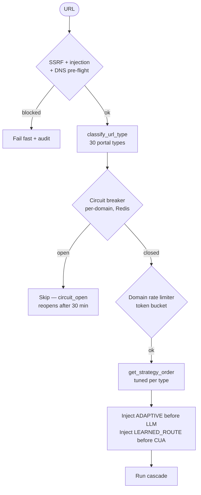
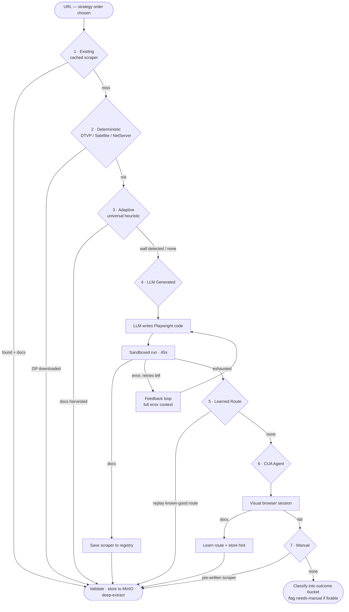
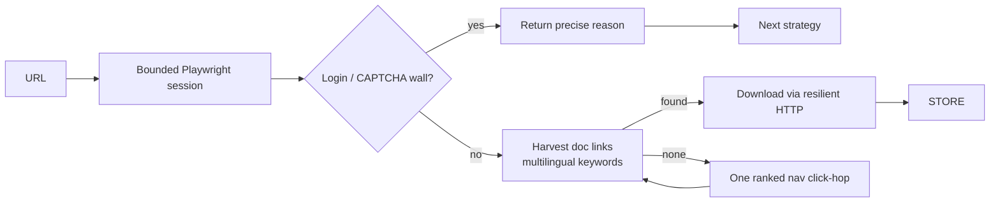
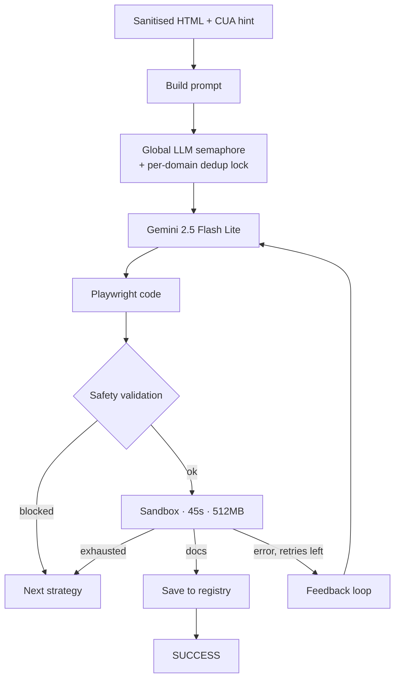
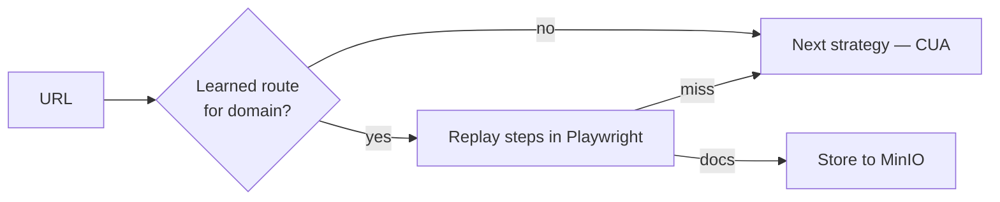
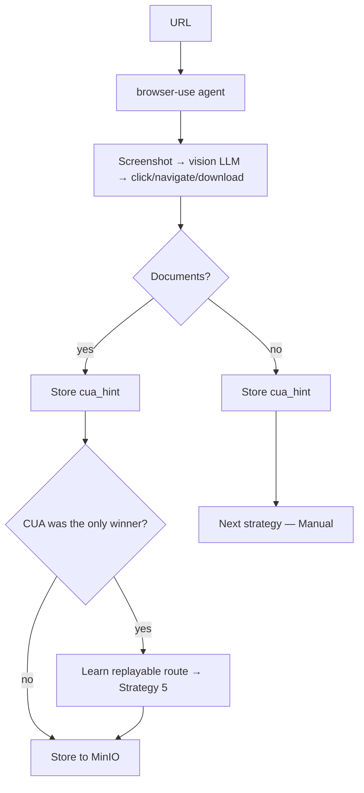
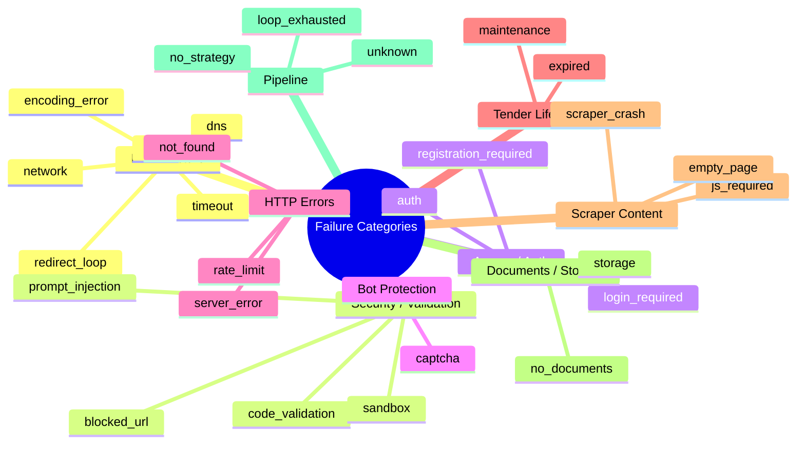
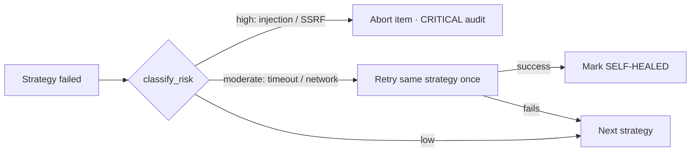
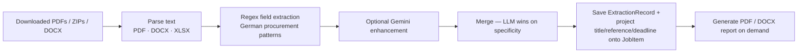

# Cascade Pipeline — Vergabepilot.AI

## Overview

The cascade pipeline is the core engine of Vergabepilot.AI. For every procurement notice URL, it tries up to **7 strategies** in cost-ascending order, stopping as soon as one returns documents. Each stage is cheaper than the next; expensive AI stages are only used as a last resort — and skipped entirely when a URL's portal type says they can't work.

```
Existing → Deterministic → Adaptive → LLM Generated → Learned Route → CUA Agent → Manual
  ↓ ms        ↓ free         ↓ free      ↓ LLM            ↓ cheap         ↓ visual     ↓ legacy
  cached      direct ZIP     heuristic   self-healing     replay route    vision LLM   pre-written
```

The exact order is **tuned per URL type** by `phase3_integration/url_intelligence.py` — not every URL runs all 7. Two strategies are injected automatically: `ADAPTIVE` just before the paid `LLM_GENERATED` step, and `LEARNED_ROUTE` just before `CUA`.

**Strategy enum** (`models.Strategy`):

| Enum value | Strategy |
|---|---|
| `existing_scraper` | 1 — Existing / cached scraper |
| `deterministic_template` | 2 — Deterministic platform template |
| `adaptive_universal` | 3 — Universal heuristic (country/language-agnostic) |
| `llm_generated_scraper` | 4 — LLM code generation + sandbox |
| `learned_route` | 5 — Replay a CUA-proven route |
| `computer_use_agent` | 6 — Visual browser agent |
| `manual_scraper` | 7 — Hand-written reference scraper |

---

## Pre-cascade: URL Intelligence

Before any strategy runs, the pipeline pre-classifies the URL (no HTTP) and applies resilience guards. This is the single biggest reliability win for large runs.



- **Auth-gated portals** (`NETSERVER_AUTH`, `EVERGABE_DEEP`, `EVA_PORTAL`) → `[EXISTING, CUA, MANUAL]` — the LLM is skipped because logs show it never succeeds on login walls.
- **Satellite / DTVP** → `[DETERMINISTIC, EXISTING, MANUAL]` — straight to a free direct download.
- **Well-structured public portals** (TED, UK, NL, US, AU, …) → `[EXISTING, (ADAPTIVE), LLM, MANUAL, CUA]`.
- **`UNKNOWN`** → full cascade, with the free `ADAPTIVE` heuristic carrying the country-agnostic load.

See [ARCHITECTURE.md §3](ARCHITECTURE.md#3-url-intelligence--resilience) for the circuit breaker / rate limiter state machines and the per-type strategy table.

---

## Full Pipeline Flow



A failure between stages may trigger **self-healing** (moderate-risk errors are retried once before escalating) or an **early abort** (high-risk security errors stop the whole item). See [Self-Healing](#self-healing-mechanism).

---

## Strategy 1 — Existing Cached Scraper

**Cost:** Free · **Speed:** ms–25 s · **File:** `phase3_integration/scraper_registry.py`

The fastest path. When a scraper was previously generated or hand-written for this domain, it is loaded from PostgreSQL (`ScraperTemplate`) and run in the sandbox. CUA-hint-only stubs (placeholder rows with `source="cua"`) are skipped so they never pollute the failure counters.

**Registry update rules:** `success_count` / `failure_count` / `avg_runtime` (EMA) are updated on every run; scrapers that fail consistently are deprioritised and eventually retired.

---

## Strategy 2 — Deterministic Template

**Cost:** Free · **Speed:** 1–50 s · **File:** `phase3_integration/deterministic.py`

For known platform families (DTVP / VMPSatellite / NetServer) the download URL is constructed directly from the notice URL and the ZIP is streamed — no Playwright, no LLM. The platform is fingerprinted by `platform_classifier.py` from the URL, and refined from the HTML if the URL alone is inconclusive (a DTVP URL discovered in the HTML re-routes here even mid-cascade).

---

## Strategy 3 — Adaptive Universal Heuristic *(new)*

**Cost:** Free · **Speed:** 5–30 s · **Files:** `phase3_integration/adaptive_scraper.py`, `core/web_harvest.py`

A genuinely **country- and language-agnostic** scraper: one bounded Playwright session that harvests document links directly, or after a single multilingual click-hop, using `DOC_NAV_KEYWORDS` (document/download/attachment terms across many languages) instead of hardcoded selectors. It runs **before** any paid LLM step, so most unrecognised public portals never cost a cent. A miss returns a *precise* reason — e.g. a detected login or CAPTCHA wall — so the failure is explained, not generic.



---

## Strategy 4 — LLM Scraper Generation

**Cost:** ~$0.00001 / URL · **Speed:** 10–45 s · **Files:** `phase1_llm_scraper/generator.py`, `executor.py`, `feedback_loop.py`

The LLM reads the portal's (sanitised) HTML and any stored **CUA hint** for the domain, then generates custom Playwright code. The code is safety-validated, run in a sandbox, and on failure the **full error context** (code + stdout/stderr + traceback) is sent back for up to 3 self-healing iterations. A successful scraper is saved to the registry and reused for free forever (Strategy 1 on the next visit).



**Concurrency safety:** a global semaphore caps simultaneous OpenRouter calls (`LLM_GLOBAL_CONCURRENCY`), and a Redis `NX` **domain dedup lock** (`DOMAIN_LLM_LOCK_TTL`) ensures that when many URLs share a domain, only one worker generates the scraper while the rest wait and reuse it — instead of all hitting the API at once.

> Optional **route learning** (`ENABLE_ROUTE_LEARNING=true`, off by default) runs a Playwright pass that traces the click path to the documents and hands it to the LLM as ground truth. It is disabled by default because it adds 20–30 s per URL.

---

## Strategy 5 — Learned Route Replay *(new)*

**Cost:** Cheap (Playwright only) · **Speed:** 5–20 s · **File:** `phase2_cua/route_learner.py`

When the CUA (Strategy 6) is the *only* thing that ever worked for a domain, the system distils its successful navigation into a replayable `LearnedRoute` (stored in `ScraperTemplate.learned_route`). On the next visit, this strategy **replays that route with plain Playwright** — no LLM, no vision, no full CUA cost. It fast-fails when no route was learned, so the cascade moves straight to CUA.



---

## Strategy 6 — Computer Use Agent (CUA)

**Cost:** ~$0.001–0.05 / session · **Speed:** 30–120 s · **Files:** `phase2_cua/browser_agent.py`, `browser_use_agent.py`, `orchestrator.py`

A visual browser-automation agent (unified on `browser-use`) that *sees* the page via screenshots and clicks like a human — the last resort for portals that resist everything else (heavy JS, session-gated downloads, visual login flows).

After **every** CUA run (success or failure) the interaction trace is stored as a `cua_hint`, improving future LLM generation for that domain. After a CUA-**only** success (every cheaper strategy already failed), the route is learned for Strategy 5.



---

## Strategy 7 — Manual Reference Scraper

**Cost:** Free · **Speed:** 5–45 s · **File:** `phase0_manual/v1_reference.py` + `data/scrapers/`

Hand-written, battle-tested Playwright scripts for the highest-volume or hardest domains. ~50 domain scrapers live in `data/scrapers/` and are seeded into the registry on startup; many delegate to shared generic scrapers (e.g. the NetServer-public generic). Priority inside a manual scraper: "Download All" button → ZIP links → scored document links → button handlers → NetServer URL recovery.

---

## Error Classification

Every failure is classified by `core.security.classify_error` into one of **27 fine-grained categories** for analytics, then mapped to a human-readable reason for the UI.



---

## Honest Outcome Buckets

For triage, the 27 categories collapse into **8 coarse outcome buckets** (`phase3_integration/outcomes.py`). Two of them — `auth_gated` and `captcha` — are the only ones a human can actually fix, and they surface in the **"Needs manual action"** queue (`GET /api/jobs/needs-manual`) with a suggested next step. `/api/admin/stats` returns the bucket counts.

| Bucket | Label | Human-fixable | Suggested action |
|---|---|:---:|---|
| `success` | Succeeded | — | — |
| `auth_gated` | Login / registration required | ✅ | Log in or supply credentials, then retry |
| `captcha` | CAPTCHA / bot block | ✅ | Clear the check in a real browser, then retry |
| `expired` | Expired or not found | — | Verify the tender is still open |
| `unreachable` | Unreachable (network / server) | — | Transient — retry later (breaker reopens) |
| `no_documents` | No documents found | — | Confirm docs are actually published |
| `blocked` | Blocked (security) | — | Review URL — blocked by SSRF/security guards |
| `error` | Error — needs investigation | — | Inspect error detail + audit trail |

This is the project's core philosophy: *"never fail" is impossible (auth walls, CAPTCHA, payment, expired, legal) — the goal is **maximum coverage plus graceful, explained failure**.*

---

## Self-Healing Mechanism

For **moderate-risk** errors (timeout, network, empty_page, …) the pipeline retries the same strategy once before escalating. **High-risk** security errors (prompt injection, SSRF) abort the whole item immediately.



---

## Deep Extraction (Post-Download)

After documents are stored, deep extraction runs automatically (failure never blocks the pipeline). It is **regex/structural first**, with optional Gemini enhancement.



**Extracted fields (22):** `vergabenummer`, `ted_reference`, `auftraggeber`, `vergabestelle`, `titel`, `vergabeverfahren`, `auftragsart`, `veroeffentlichungsdatum`, `abgabefrist`, `bindefrist`, `cpv_codes`, `nuts_codes`, `auftragswert`, `waehrung`, `leistungsort`, `laufzeit`, `ansprechpartner`, `email`, `telefon`, `fax`, `zuschlagskriterien`, `eignungskriterien`.

The extractor also writes a denormalized projection (`tender_title`, `tender_reference`, `deadline`) onto the `JobItem` so the public tender directory can filter "open" and sort "soonest-closing" with a real index.
