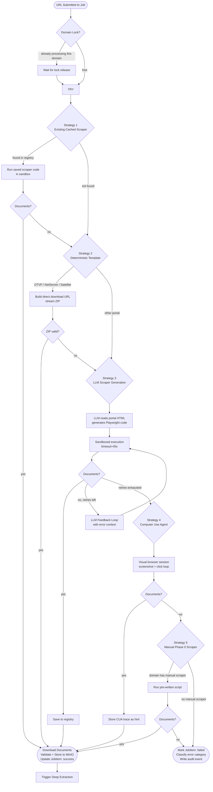
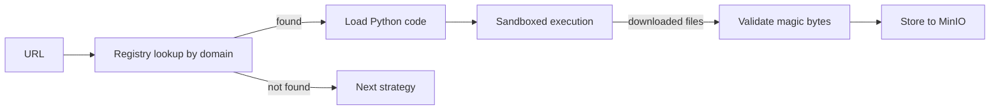
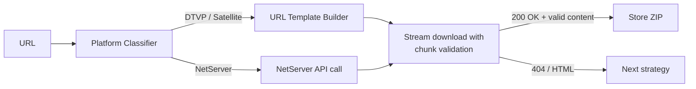
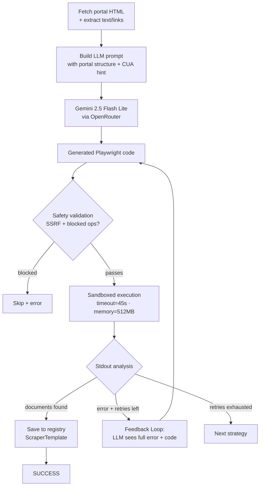
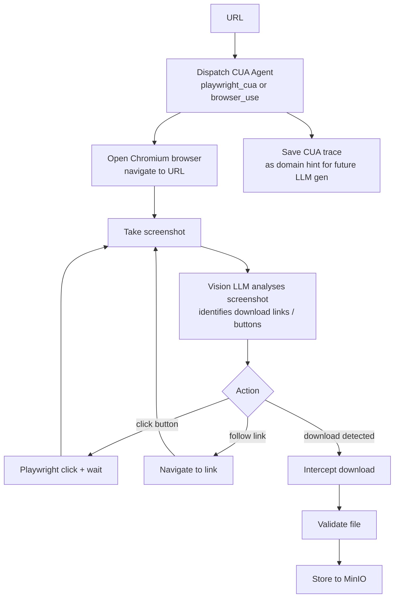
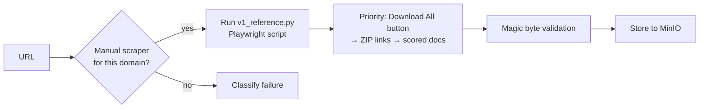
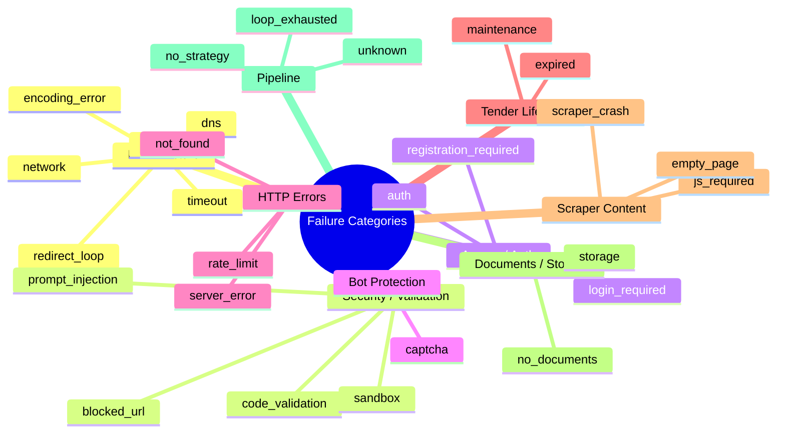
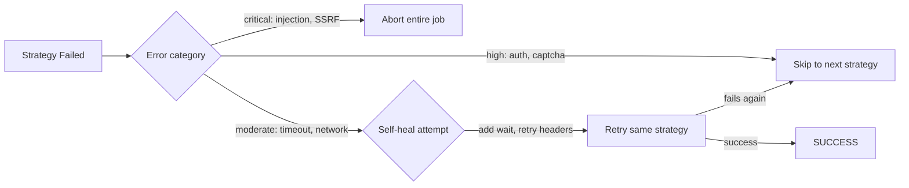
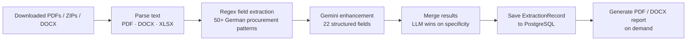

# Cascade Pipeline — Vergabepilot.AI

## Overview

The cascade pipeline is the core engine of Vergabepilot.AI. For every procurement notice URL, it tries up to 5 strategies in order, stopping as soon as one succeeds. Each stage is cheaper and faster than the next; expensive AI stages are only used as a last resort.

```
Existing Cached → Deterministic → LLM Generated → CUA Agent → Manual Scraper
     ↓ fast              ↓ free         ↓ LLM           ↓ visual      ↓ legacy
     ms                 seconds        10–45s          30–120s       5–45s
```

---

## Full Pipeline Flow



---

## Strategy 1 — Existing Cached Scraper

**Cost:** Free (no LLM call)  
**Speed:** Milliseconds to seconds  
**File:** `app/phase3_integration/scraper_registry.py`

The fastest path. When a scraper was previously generated and saved for this domain, it is loaded and run again immediately. The registry checks PostgreSQL for a `ScraperTemplate` row by domain.



**Registry update rules:**
- `success_count` incremented on each successful run
- `failure_count` incremented on failure
- `avg_runtime` updated with exponential moving average
- Scrapers with `failure_count / (success_count + failure_count) > 0.8` are deprioritised

---

## Strategy 2 — Deterministic Template

**Cost:** Free (no LLM call)  
**Speed:** 2–10 seconds  
**File:** `app/phase3_integration/deterministic.py`

For known platform families where the download URL can be constructed directly from the notice URL using a template. No scraping needed — just a direct HTTP download.



**Supported platforms:**

| Platform | Detection | Template |
|---|---|---|
| DTVP / Satellite | URL contains `dtvp.de/Satellite` | `{base}/de/documents` → ZIP |
| NetServer | URL hostname in NetServer registry | API endpoint construction |

---

## Strategy 3 — LLM Scraper Generation

**Cost:** ~$0.00001 per URL (Gemini 2.5 Flash Lite)  
**Speed:** 10–45 seconds  
**Files:** `app/phase1_llm_scraper/generator.py`, `executor.py`, `feedback_loop.py`

The LLM reads the portal's HTML structure and generates custom Playwright code to navigate and download documents. A feedback loop retries up to 3 times with full error context.



**Feedback loop detail:**

The error context sent back to the LLM includes:
- The original generated code
- The complete stdout/stderr from the failed run
- The exception traceback if any
- The portal URL and detected platform

This allows the LLM to self-diagnose and correct issues like wrong selectors, missing waits, or incorrect download logic.

---

## Strategy 4 — Computer Use Agent (CUA)

**Cost:** ~$0.001–0.05 per session (vision model)  
**Speed:** 30–120 seconds  
**Files:** `app/phase2_cua/browser_agent.py`, `browser_use_agent.py`, `orchestrator.py`

A visual browser automation agent that takes screenshots of the portal and uses a vision LLM to decide what to click. Bypasses portals that resist traditional scraping (heavy JS, CAPTCHA-adjacent flows, session-gated downloads).



**Agent types:**

| Engine | Technology | Best for |
|---|---|---|
| `playwright_cua` | Raw Playwright + vision LLM | Standard portals, custom flows |
| `browser_use` | browser-use framework | Portals with complex state |

**CUA Hints:** After every CUA run (success or failure), the interaction trace is stored in `ScraperTemplate.cua_hint`. This gives the LLM generator verified navigation knowledge in future scraper generation calls, improving success rates.

---

## Strategy 5 — Manual Phase 0 Scraper

**Cost:** Free  
**Speed:** 5–45 seconds  
**File:** `app/phase0_manual/v1_reference.py`

Pre-written, battle-tested Playwright scripts for high-volume domains that are too complex or auth-gated for generated scrapers. These scripts are maintained manually and have the highest reliability.



**Priority order inside manual scraper:**
1. "Download All" button → downloads complete ZIP
2. Individual ZIP download links
3. Scored document links (PDFs ranked by relevance)
4. Button `onclick` handlers
5. NetServer URL recovery from tender IDs

---

## Error Classification

When all strategies fail, the failure is classified into one of 27 categories for analytics:



---

## Self-Healing Mechanism

For **moderate-risk errors** (timeout, network, empty_page, js_required), the pipeline attempts automatic recovery before escalating:



---

## Deep Extraction (Post-Download)

After documents are stored, deep extraction runs automatically:



**Extracted fields:** `vergabenummer`, `ted_reference`, `auftraggeber`, `vergabestelle`, `titel`, `vergabeverfahren`, `auftragsart`, `veroeffentlichungsdatum`, `abgabefrist`, `bindefrist`, `cpv_codes`, `nuts_codes`, `auftragswert`, `waehrung`, `leistungsort`, `laufzeit`, `ansprechpartner`, `email`, `telefon`, `fax`, `zuschlagskriterien`, `eignungskriterien`
