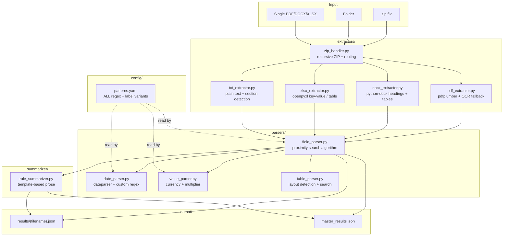
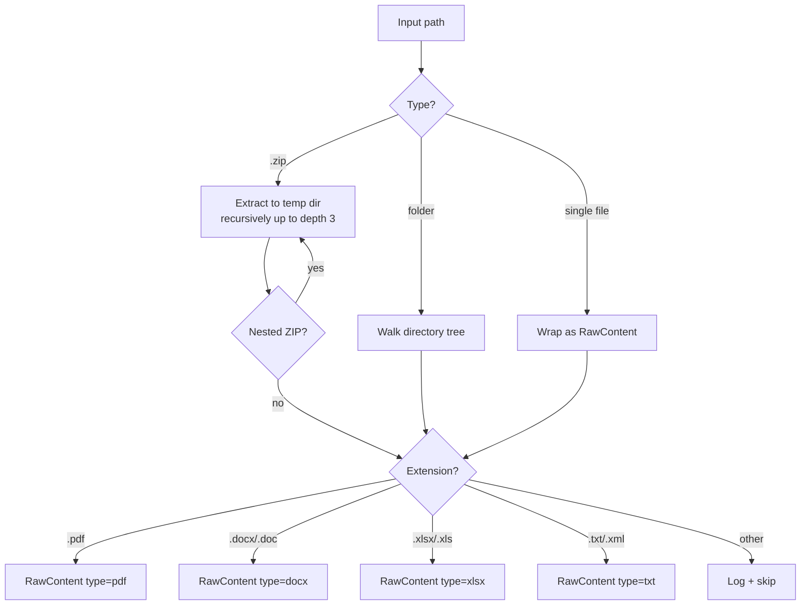
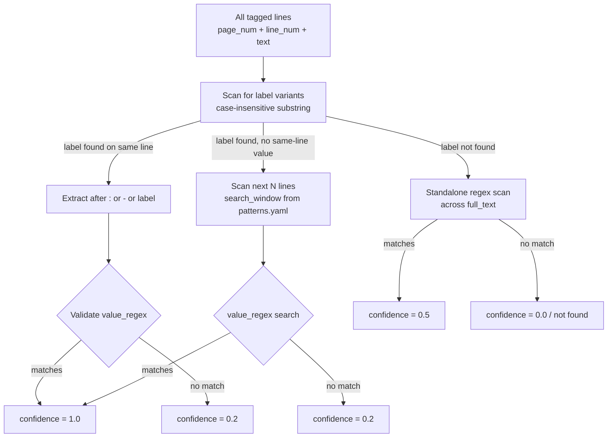

# Tender Extractor — Document Extraction Module

> **Status:** The standalone `tender_extractor/` package is now archived under
> [`_archive/tender_extractor/`](../_archive/tender_extractor/). Its design lives
> on inside the **active** in-process engine at
> [`backend/app/document_extractor/`](../backend/app/document_extractor/), which
> runs automatically after every successful download and is exposed through the
> [`/api/extraction`](API.md#7-extraction--api) endpoints. Both share the same
> rule-based approach and the same 22 procurement fields; the active engine adds
> an *optional* Gemini field-boost and persists results to PostgreSQL
> (`ExtractionRecord`). This document describes the rule-based design common to both.

The extractor is a **rule-based, deterministic** pipeline for pulling structured procurement fields from tender documents. The offline library runs with zero LLM calls, zero internet access, and zero external AI services — entirely deterministic and reproducible; the in-process engine layers an optional LLM field-boost on top.

## Table of Contents
1. [Overview](#1-overview)
2. [Architecture](#2-architecture)
3. [Extraction Pipeline](#3-extraction-pipeline)
4. [Field Definitions](#4-field-definitions)
5. [CLI Usage](#5-cli-usage)
6. [Python API](#6-python-api)
7. [Configuration (patterns.yaml)](#7-configuration-patternsyaml)
8. [Output Format](#8-output-format)
9. [Running Tests](#9-running-tests)

---

## 1. Overview

```
ZIP / Folder / PDF / DOCX / XLSX
           ↓
   [ZIP Handler — recursive extraction]
           ↓
   [File Router — PDF / DOCX / XLSX / TXT]
           ↓
   [Field Parser — proximity search + regex]
   [Date Parser — ISO 8601 normalisation]
   [Value Parser — currency + multiplier]
   [Table Parser — key-value / data table]
           ↓
   [Rule Summarizer — template-based prose]
           ↓
   JSON results + master_results.json
```

**Hard constraints (by design):**
- No LLM calls
- No internet access after `pip install`
- No OpenAI, Anthropic, HuggingFace inference
- All patterns in `config/patterns.yaml` — zero hardcoded strings in `.py` files

---

## 2. Architecture



---

## 3. Extraction Pipeline

### Step 1 — ZIP Handling & File Routing

`zip_handler.py` accepts a file or folder and produces a flat list of `RawContent` objects:



**Safety limits:** MAX_DEPTH=4, MAX_FILES=500, MAX_UNZIPPED_MB=500, path traversal prevention.

### Step 2 — Document Extraction

Each extractor returns a unified `DocumentContent`:

```python
@dataclass
class DocumentContent:
    filename: str
    file_type: str
    pages: list[PageContent]      # page_num + text + lines
    full_text: str
    all_tables: list[TableContent] # headers + rows + page_num
    metadata: dict                 # title, author, creation_date…
    sections_index: dict           # section_name → page_num
    sheets: list[dict] | None      # XLSX only
```

**PDF extraction** (pdfplumber):
- Text extracted page-by-page with line tagging
- Section headers detected by 3 heuristics: ALL CAPS, numbered (`1.2.3`), short line ending with `:`
- Tables extracted per page → first row = header, rest = row dicts
- Fallback: if text < 100 chars, OCR via `pdf2image + pytesseract`

**DOCX extraction** (python-docx):
- Paragraphs walked in document order with style names (`Heading 1`, `Normal`…)
- Section tree built from heading hierarchy
- Bold runs detected as field labels
- All tables extracted

**XLSX extraction** (openpyxl):
- Per-sheet layout auto-detection: `key_value` (col A = labels) or `table` (row 0 = headers)
- Key-value sheets → flat `{label: value}` dict
- Table sheets → list of row dicts

### Step 3 — Field Parsing

`field_parser.py` runs the proximity search algorithm for every field defined in `patterns.yaml`:



**Confidence scores:**

| Score | Meaning |
|---|---|
| `1.0` | Label matched + value passed validation regex |
| `0.8` | Label matched + value extracted, no regex defined |
| `0.5` | Standalone regex match, no label found |
| `0.2` | Fallback/heuristic, flag for manual review |
| `0.0` | Not found |

### Step 4 — Date Normalisation

`date_parser.py` normalises any date string to ISO 8601 (`YYYY-MM-DD`):

1. Try `dateparser.parse()` with strict settings
2. Try 7 custom regex patterns (DD/MM/YYYY, DD.MM.YYYY, DD-Mon-YY, etc.)
3. If all fail → return raw string + `low_confidence=True`

**Supported formats:** `15/03/2025`, `15.03.25`, `15-Mar-25`, `15 March 2025`, `March 15, 2025`, `2025-03-15`, German months (`März`, `Oktober`…)

### Step 5 — Value/Currency Parsing

`value_parser.py` extracts structured monetary amounts:

```python
parse_value("EUR 1,500,000")   # → {"amount": 1500000, "currency": "EUR", "raw": "EUR 1,500,000"}
parse_value("1.5M USD")        # → {"amount": 1500000, "currency": "USD"}
parse_value("Rs. 45 Lakhs")    # → {"amount": 4500000, "currency": "INR"}
parse_value("€ 2 Crores")      # → {"amount": 20000000, "currency": "EUR"}
```

**Supported:** `€ $ £ ₹ ¥` symbols + ISO codes (EUR, USD, GBP, INR, CHF, AED, SAR, JPY, CAD, AUD)  
**Multipliers:** million, bn, lakh/lakhs, crore/crores, k

### Step 6 — Rule-Based Summary

`rule_summarizer.py` composes human-readable prose from extracted fields — no LLM, no templates with empty slots:

```
Input fields:
  tender_type="Open", issuing_authority="Ministry of Finance",
  tender_title="Supply of IT Equipment", submission_deadline="2025-03-15",
  tender_value={"amount": 500000, "currency": "EUR"}

Output paragraph:
  "Open tender issued by Ministry of Finance for Supply of IT Equipment.
   The closing date for submissions is 15 March 2025. The estimated
   contract value is EUR 500,000."

Output bullets:
  ["Issuing authority: Ministry of Finance",
   "Title: Supply of IT Equipment",
   "Deadline: 15 March 2025",
   "Estimated value: EUR 500,000",
   "Type: Open"]
```

Rule: **if a field is None, its sentence is skipped entirely — "N/A" never appears.**

---

## 4. Field Definitions

All 13 fields extracted, defined in `config/patterns.yaml`:

| Field | Labels (examples) | Validation regex | Type |
|---|---|---|---|
| `tender_id` | "tender no", "vergabenummer", "aktenzeichen" | `[\w][\w\-\/\.\_]{2,40}` | string |
| `tender_title` | "subject", "auftragsgegenstand", "titel" | `.{5,200}` | string |
| `issuing_authority` | "issued by", "auftraggeber", "vergabestelle" | `.{3,150}` | string |
| `publication_date` | "published", "veröffentlichungsdatum" | date pattern | date → ISO |
| `submission_deadline` | "deadline", "abgabefrist", "schlusstermin" | date pattern | date → ISO |
| `tender_value` | "estimated value", "auftragswert", "schätzwert" | currency pattern | `{amount, currency}` |
| `contact_name` | "contact person", "ansprechpartner" | `[A-Z][a-z]+ [A-Z][a-z]+` | string |
| `contact_email` | "email", "e-mail-adresse" | email regex | string |
| `contact_phone` | "phone", "telefon", "durchwahl" | phone regex | string |
| `cpv_codes` | "cpv", "cpv code" | `\d{8}(?:-\d)?` | list (all matches) |
| `scope_of_work` | "scope", "leistungsbeschreibung" | section body | string (multi-line) |
| `eligibility` | "eligibility", "eignungskriterien" | section body | string (multi-line) |
| `tender_type` | keyword scan | — | string (Open/RFP/etc.) |

**Tender types detected:** `open`, `restricted`, `rfp`, `rfq`, `negotiated`, `eoi`

**Language support:** Both English and German label variants in `patterns.yaml`.

---

## 5. CLI Usage

```bash
cd tender_extractor

# Process a single PDF
python main.py --input ./tender.pdf --output ./output --format json

# Process a ZIP archive
python main.py --input ./tender_package.zip --output ./output --format both --verbose

# Process a folder of documents
python main.py --input ./tender_docs/ --output ./output --format json --verbose
```

**Flags:**

| Flag | Default | Description |
|---|---|---|
| `--input` / `-i` | required | PDF, DOCX, XLSX, ZIP, or folder |
| `--output` / `-o` | `./output` | Results directory |
| `--format` / `-f` | `json` | `json`, `csv`, or `both` |
| `--verbose` / `-v` | off | Show per-field extraction detail |

**Example verbose output:**
```
────────────────────────────────────────────────────────
  tender_package.pdf
────────────────────────────────────────────────────────
  tender_id              1.00  VN-2025-042
  tender_title           0.80  Lieferung von Büromöbeln
  submission_deadline    1.00  2025-07-15
  tender_value           1.00  {'amount': 500000, 'currency': 'EUR'}
  contact_email          1.00  vergabe@amt.de
  cpv_codes              0.50  ['39130000', '39150000']
```

**Rich terminal table:**
```
┌─────────────────────┬──────┬──────────────┬────────────────┬──────────────────────┬────────┐
│ File                │ Type │ Fields Found │ Avg Confidence │ Low Confidence       │ Status │
├─────────────────────┼──────┼──────────────┼────────────────┼──────────────────────┼────────┤
│ tender.pdf          │ PDF  │ 9            │ 0.87           │ scope_of_work        │ OK     │
└─────────────────────┴──────┴──────────────┴────────────────┴──────────────────────┴────────┘
```

---

## 6. Python API

```python
from tender_extractor.pipeline import process_batch

# Process a ZIP and return all results as dicts
results = process_batch(
    input_path="./tender_package.zip",
    output_dir="./output",
    file_format="json",
    verbose=False,
)

# Each result has:
result = results[0]
result["file"]                    # "RFP_001.pdf"
result["fields"]["tender_id"]     # {"value": "RFP-2025-042", "confidence": 1.0}
result["fields"]["submission_deadline"]["value"]  # "2025-03-15" (ISO 8601)
result["summary"]                 # "Open tender issued by..."
result["summary_bullets"]         # ["Deadline: 15 March 2025", ...]
result["low_confidence_fields"]   # ["scope_of_work"]
result["tables_extracted"]        # 3
result["pages"]                   # 12
```

**Using individual parsers:**

```python
from tender_extractor.parsers.date_parser import parse_date
from tender_extractor.parsers.value_parser import parse_value

parse_date("15/03/2025")          # {"value": "2025-03-15", "low_confidence": False}
parse_date("15-Mar-25")           # {"value": "2025-03-15", "low_confidence": False}
parse_date("garbage")             # {"value": "garbage", "low_confidence": True}
parse_date("")                    # None

parse_value("EUR 1,500,000")      # {"amount": 1500000, "currency": "EUR", "raw": "..."}
parse_value("Rs. 45 Lakhs")       # {"amount": 4500000, "currency": "INR", "raw": "..."}
```

---

## 7. Configuration (patterns.yaml)

All extraction rules live in `config/patterns.yaml`. No regex or label strings are hardcoded in `.py` files.

```yaml
settings:
  search_window: 5           # lines to look ahead after label match
  min_confidence: 0.2        # discard results below this
  ocr_dpi: 200               # DPI for pdf2image OCR fallback
  ocr_lang: "deu+eng"        # tesseract language pack

fields:
  tender_id:
    labels:
      - "tender no"
      - "vergabenummer"
      - "aktenzeichen"
    value_regex: '[\w][\w\-\/\.\_]{2,40}'
    search_window: 3

  submission_deadline:
    labels:
      - "submission deadline"
      - "abgabefrist"
      - "schlusstermin"
    value_regex: '\d{1,2}[\.\-\/]\d{1,2}[\.\-\/]\d{2,4}|...'
    search_window: 4

tender_types:
  open:
    keywords:
      - "open tender"
      - "offenes verfahren"
      - "öffentliche ausschreibung"
  rfp:
    keywords:
      - "request for proposal"
      - "rfp"

standalone_patterns:
  email: '[a-zA-Z0-9._%+\-]+@[a-zA-Z0-9.\-]+\.[a-zA-Z]{2,}'
  cpv_code: '\b\d{8}(?:-\d)?\b'
```

**To add a new field:** Add a new entry under `fields:` with `labels` and `value_regex`. No Python changes needed.

---

## 8. Output Format

### Per-Document JSON

```json
{
  "file": "RFP_001.pdf",
  "source_zip": "tender_package.zip",
  "processed_at": "2025-06-06T10:30:00",
  "summary": "Open tender issued by Ministry of Finance for Supply of IT Equipment...",
  "summary_bullets": [
    "Issuing authority: Ministry of Finance",
    "Deadline: 15 March 2025",
    "Estimated value: EUR 500,000",
    "Type: Open"
  ],
  "fields": {
    "tender_id": {
      "value": "RFP-2025-042",
      "confidence": 1.0,
      "source_page": 1,
      "low_confidence": false
    },
    "submission_deadline": {
      "value": "2025-03-15",
      "confidence": 1.0,
      "source_page": 2,
      "low_confidence": false
    },
    "tender_value": {
      "value": { "amount": 500000, "currency": "EUR" },
      "confidence": 0.85,
      "source_page": 1,
      "low_confidence": false
    },
    "scope_of_work": {
      "value": "The contractor shall supply and install...",
      "confidence": 0.8,
      "source_page": null,
      "low_confidence": false
    }
  },
  "low_confidence_fields": [],
  "tables_extracted": 3,
  "pages": 12
}
```

### Master Results JSON

`output/master_results.json` — array of all per-document results in a single file for batch processing.

---

## 9. Running Tests

```bash
cd tender_extractor

# Run all 28 tests
pytest tests/ -v

# Tests cover:
# - Date parser: 9 formats + edge cases
# - Value parser: 6 currency/multiplier variants
# - Field parser: same-line, next-line, standalone, not-found
# - Rule summarizer: all-fields, partial, all-None
# - Pipeline integration: synthetic tender document end-to-end
```

**Test results:** 28/28 passing ✓
